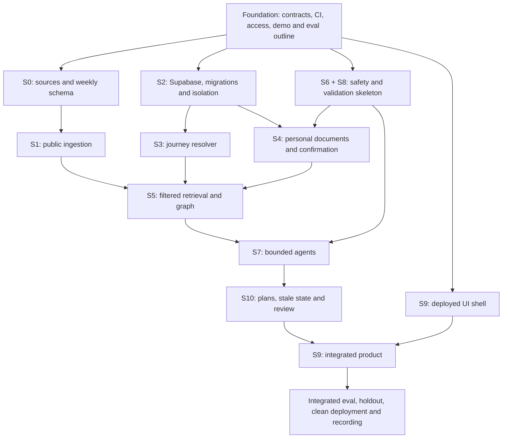

# Nestline execution plan

**Prepared:** 9 September 2026, IST

**Target:** submission-ready V1 by Saturday 12 September; selected-team demo on 16 September

**Status:** full canonical scope confirmed; daily availability and elapsed delivery forecast remain to be measured

**Architecture authority:** [Nestline updated architecture](<Nestline updated architecture.md>), 9 September 2026

**Repository:** https://github.com/kajalchourasia-cmd/nestline

**Implementation status:** Stage 0's draft data foundation, Stage 1 engineering and
the Stage 2 Supabase foundation are implemented. Kajal's content/product decisions
for the first `PC00`/`P10`/`PP01` slice are recorded; specialist and release reviews
remain open. See [project progress](PROJECT-PROGRESS.md).

## 1. The outcome we are building toward

Nestline should demonstrate that a confirmed change in a fictional maternal record changes the right downstream behavior, with visible evidence and predictable handling of uncertainty. Compass must distinguish public guidance, user reports, and confirmed records. A reviewer should be able to reproduce the result from a clean setup and inspect why it happened.

The award ambition translates into five deliverables: a coherent product experience, one convincing continuity scenario, trustworthy controls, measured improvement, and a clear reproducible presentation. An award cannot be guaranteed. The competition's original rubric attachments are not present in this folder; add a rubric-to-evidence mapping when they are available rather than inventing judging weights.

This plan starts project execution through a prioritized backlog, estimates, gates, and delivery order. It does not mark application code, credentials, content review, or tests as complete. Every unchecked item below is still work to do.

## 2. Architecture and scope decisions

Retain the canonical baseline: Streamlit, Supabase Postgres/Auth/private Storage/RLS/pgvector, Postgres full-text search, graph node/edge tables in Postgres, LangGraph, typed Python tools, a provider adapter, Pydantic, and LangSmith with redacted local trace fallback. Postgres full-text search must not be described as BM25 unless an actual BM25 implementation is introduced and measured.

Grok is a candidate, not an already selected primary provider. Verify access and compare it with one available fallback using the same evidence and schemas. Fireworks can be that candidate; it is already contemplated by the canonical architecture. Runtime model selection and automatic failover require an explicit tested policy.

Keep confirmed personal truth in Supabase. Do not add Neo4j, Pinecone, Mem0, MCP, Ollama, WhatsApp, multilingual generation, videos, n8n, or fine-tuning to the critical path. These are possible experiments with admission criteria in Section 12, not rejected long-term ideas. Additional infrastructure is justified by a demonstrated failure and measured benefit.

The prototype remains fictional-data-only with simulated human review. Startup engineering discipline applies now: reproducibility, migrations, ownership, reviews, budgets, failure behavior, and evidence. Real clinical deployment is a separate gated program, not a label obtained by completing this sprint.

## 3. Estimates, capacity, and the deadline

These are engineering estimates, not measured velocities. A **person-hour** is a human-equivalent estimate of focused implementation, review, or verification effort; it is not a prediction of Codex execution time. Two people working for three hours provide six person-hours, not six elapsed hours. AI assistance can accelerate drafting and coding; it does not eliminate content review, integration, debugging, or acceptance work.

Confirmed delivery model: **Kajal owns product, evaluation and UI; Codex implements the technical system and guides integration; Aswath coordinates technical decisions, accounts and acceptance.** Kajal is not assigned backend or ingestion implementation. Codex can assist her UI/eval implementation, but she owns the product decisions and acceptance criteria.

Daily human availability is still unconfirmed. For a conservative comparison only, two people at six focused hours per full day and three hours each for the remainder of Wednesday would provide **42 person-hours** through Saturday: 6 + 12 + 12 + 12. This is not a staffing commitment or a Codex throughput forecast. Technical tasks run in active Codex work sessions; the plan does not schedule unattended work automatically. Recalibrate elapsed delivery after the first vertical slice, recording Codex elapsed time separately from human review effort.

### Complete canonical build estimate

The stage estimates include local component checks; the evaluation workstream separately covers cross-component experiments, failure analysis, holdout, and regression. Content sourcing includes team review effort but excludes waiting for third-party permission or qualified clinical review. Platform provisioning delays are also outside engineering effort.

| Work package | Canonical reference | Dependency | Person-hours: low / likely / high | Accountable role |
|---|---|---|---:|---|
| F. Foundation and delivery contract | Phase 0, Section 18 | None | 4 / 5 / 6 | Engineering lead |
| S0. Weekly content and source contracts | Stage 0, Section 4 | F | 6 / 8 / 10 | Product/content |
| S1. Public ingestion | Stage 1, Section 5 | S0; S2 for publication | 6 / 8 / 10 | AI/data |
| S2. Database, isolation, migrations | Stage 2, Section 6 | F; S0 schemas | 8 / 10 / 12 | Data/app |
| S3. Onboarding and journey resolver | Stage 3, Section 7 | F; S2 integration | 3 / 4 / 5 | Data/app |
| S4. Documents and confirmed state | Stage 4, Section 8 | S2, S3; S6 before live extraction | 9 / 12 / 15 | AI/data |
| S5. Hybrid retrieval and graph | Stage 5, Section 9 | S1, S2, S3; S4 for personal path | 9 / 12 / 15 | AI/data |
| S6. Safety gate | Stage 6, Section 10 | F; reviewed rule specification | 4 / 6 / 8 | Safety/evaluation |
| S7. Bounded agent orchestration | Stage 7, Section 11 | S5, S6, initial S8 validators | 9 / 12 / 15 | AI/data |
| S8. Output validation | Stage 8, Section 12 | F schemas; S0 applicability | 6 / 8 / 10 | Safety/evaluation |
| S9. Complete product experience | Stage 9, Section 13 | Shell after F; integrate S3–S8 | 6 / 8 / 10 | Data/app |
| S10. Plans, state changes, human review | Stage 10, Section 14; Section 11.10 | S4, S5, S7, S8 | 6 / 8 / 10 | Data/app |
| E. Evaluation and improvement | Sections 15–17 | Starts F; final run after integration | 10 / 14 / 18 | Safety/evaluation |
| R. Deployment and submission | Sections 18–20 | Smoke deploy after F; release after E | 4 / 6 / 8 | Engineering lead |
| **Total** | | | **90 / 121 / 152** | |

Reserve approximately **24 additional person-hours** against the likely estimate for integration uncertainty: a planning envelope of **145 person-hours**. Do not add the contingency a second time when using the high estimate. With two people at six hours/day, that is approximately **12 working days**, excluding external waits; with three people, approximately eight; with four, approximately seven. Dependencies and reviewer availability can make elapsed delivery longer. Adding contributors creates workstreams; it does not make sequential gates disappear.

The full canonical architecture is the user-confirmed target. The earlier smaller
Saturday subset is withdrawn; see [ADR 0001](decisions/0001-full-canonical-scope.md).
Saturday remains the delivery target, with measured progress and transparent unfinished
scope rather than silent feature removal. All canonical stages, workers, eight fictional
documents, representative profiles and evaluation gates remain in the backlog.

### Incremental build order, full final scope

First prove the data and safety contracts with PC00/P10/PP01, then complete all nine
representative profiles. Build all 63 journey records now, keeping unpublished content
hidden. Start the document pipeline with one file, then complete all eight fixtures.
Start orchestration with one worker, then complete every canonical worker. None of
these intermediate slices is described as the finished product.

### Deadline checkpoints in IST

These are outcome targets for the Codex-assisted workflow. The effort column is an illustrative human-only comparison, not a claim that Codex works at a fixed human rate.

| Day | Available effort assumed | Work and exit evidence |
|---|---:|---|
| Wed 9 Sep, remaining evening | 6 person-hours | Repo/CI/deployment skeleton; access matrix; frozen demo script; source and schema contract; safety/eval outline; RLS test skeleton. A first deterministic request runs with an explicit fixture label. |
| Thu 10 Sep | 12 person-hours | Real Supabase isolation passes; first reviewed profile slices; query → filtered evidence → cited answer; one extracted field is confirmed and persisted with provenance. Run the initial baseline. |
| Fri 11 Sep | 12 person-hours | Three connected flows integrated; graph dependency changes saved-plan status; simulated review and urgent bypass work. Freeze features by Friday EOD. |
| Sat 12 Sep | 12 person-hours | Use first half for measured fixes and regression; target release decision by 15:00, recording by 18:00, submission by 20:00. Keep remaining time before EOD for upload/recovery. Verify the organizer's actual cutoff/timezone. |

If a checkpoint slips, report remaining scope and revise elapsed estimates. Do not silently drop canonical capabilities or present failing release gates as passing.

## 4. One delivery order across both numbering systems

The document's Stages 0–10 describe product pipeline components; its Phases 0–7 describe delivery milestones. Stage number is not an instruction to delay safety until the sixth coding step. Build the safety contract and validators before exposing live generation.

| Canonical delivery phase | Execution-plan packages | Milestone proof |
|---|---|---|
| 0. Scope and safety lock | F, initial S6/S8/E | Agreed scenarios, constraints and expected failures |
| 1. Evidence and synthetic foundation | S0, fixture part of S4, E contract | Approved spans and expected fictional truth |
| 2. Scaffold and deterministic core | S2, S3, S9 shell, R smoke deploy | Clean setup, isolated demo and resolver |
| 3. RAG and document-to-state | S1, S4, S5 | Cited answer and explicit confirmed update |
| 4. Safety and orchestration | S6, S7, S8 | Urgent bypass; bounded routine calls |
| 5. Graph and human responsibility | S5 graph, S10 | Stale-plan explanation and review packet |
| 6. Evaluation-driven improvement | E throughout, final experiment | Baseline → failure → change → regression |
| 7. Submission | S9 polish, R | Three successful reset runs and release packet |

## 5. Stage-by-stage implementation backlog

Each package is ready for a GitHub issue using the stable ID. Work is not done merely because code exists: attach the test result, trace, migration, or reviewer record specified below. Owner mapping follows the user-confirmed split: data/app and AI/data implementation are Codex-led; product/content, UI and evaluation acceptance are Kajal-owned; Aswath coordinates account access and technical decisions. Safety cases and wording require joint review, with clinical review labeled separately.

### F — Foundation and delivery contract · 4–6 hours

- [ ] Confirm repository, contributors, protected data boundary, actual deadline and available API/hosting accounts; record available/unavailable/unverified without secrets.
- [ ] Set up `streamlit_app.py`, separated UI/services/agents/schemas, dependency lock, configuration validation, `.env.example`, secret ignores, lint and focused-test CI.
- [ ] Freeze three demo scripts and expected state transitions before prompt development.
- [ ] Define request context, fact state, evidence packet, agent output, plan dependency and trace schemas.
- [ ] Create decision log, risk register, release checklist and evaluation manifest with explicit development/holdout split.

**Exit:** a clean install runs a clearly labeled deterministic smoke flow; missing credentials produce actionable errors. CI passes without production secrets. No unchecked secret or real medical file is committed.

### S0 — Weekly content and source contracts · 6–10 hours

- [x] Create `source_registry.csv`, `section_manifest.jsonl`, `weekly_content_manifest.jsonl`, `coverage_matrix.csv` and a publication validator.
- [x] Create `P01`–`P42`, `PP01`–`PP12`, `PC00`, and `PPD0`–`PPD7` records; distinguish 54 weekly records from 63 total records including special states/overlays.
- [x] Map exact selected draft source spans to stage, week/range, jurisdiction, publisher/version, reuse status and review status. Preserve reusable fragments rather than invent weekly variation.
- [x] Populate review drafts for `PC00`, `P01`, `P09`, `P10`, `P24`, `P36`, `PP01`, `PP06`, `PP12`, including domain cards and explicit empty-slot reasons.
- [ ] Record actual named licence/content/clinical/India-localisation/product reviews, resolve corrections and publish the nine representative profiles plus eight day overlays. A draft or passing software check does not satisfy this gate.
- [x] Specify draft → reviewed → published → superseded transitions and unpublished-profile UI behavior.

10 September correction pass: 14 active snapshots, 55 spans and 56 fragments, nine
representative drafts and eight populated day overlays. Local checks: 95 unit
tests and 64 visible deterministic software cases. No model benchmark has run.
Food, movement, wellbeing, follow-up and hidden comparison catalogues plus eight
fictional PDF/text/extraction fixtures now exist. Read STAGE-0-CORRECTION-STATUS.md:
source currency and clinical/local interpretation still need resolution, exact
human approvals are missing, and comparisons lack verified dimensions. The
review/publication gate is still Stage 0 work, not a later-stage promise.

11 September product/content pass: Kajal accepted the wording, placement and
conditional behaviour for the 27 exact evidence tasks behind `PC00`, `P10` and
`PP01`. The governed Stage 1 ledger records 54 decisions. The attached comparison
sequence was applied, but all 42 comparisons remain hidden pending measurement,
object-dimension, clinical, localisation and licence verification. This is a
partial review milestone; the unchecked full-release item above remains open.

**Exit:** no published claim lacks approved evidence; P10/P09 applicability traps fail safely; month-only requests do not acquire an invented exact week. Team review must not be labeled clinical review unless it actually occurred.

### S1 — Governed public ingestion · 6–10 hours

- [x] Parse admitted HTML sections/PDF pages, preserve headings/tables and exact source anchors, compute checksums and record corpus/parser versions.
- [x] Validate candidate evidence; create normalized search text and embeddings only for approved units.
- [x] Make ingestion idempotent; source updates create new versions and invalidate affected published content/cache.
- [x] Provide a dry-run report showing rejected, changed, duplicate, review-required and publishable units.

Engineering complete on 10 September 2026: all 55 unique passages across 14
evidence-bearing sources resolve to source blocks. On 11 September, Kajal's 54
content/product decisions were attached to 27 current tasks. All tasks remain
review-required until their remaining roles are complete; no production embeddings
or public corpus were created.

**Exit:** ingesting the same source twice creates no duplicates; rejected sources cannot appear in retrieval; every returned citation resolves to the stored supporting passage. No live web search is used for runtime health answers.

### S2 — Storage and isolation · 8–12 hours

- [x] Version Supabase SQL migrations for workspace, journey, evidence, facts, plans, graph, review and feedback data.
- [x] Add RLS policies and private Storage access; derive workspace from authenticated session, never model arguments.
- [x] Separate user-token operations from any privileged ingestion job; no ordinary retrieval with service-role credentials.
- [x] Create/reset per-session demo workspaces. Personal Mode begins empty; Storage objects must be deleted through the Storage API before database reset.
- [x] Implement version checks, idempotency keys, atomic state updates and deletion of derived artifacts.

Completed and independently corrected on 11 September 2026 in the `nestline-dev`
Supabase project. Ten tracked migrations create 28 RLS-enabled tables, private
Storage, pgvector, release-bound provenance, owner-only workspaces, strict journey
states, normalized dependency invalidation and versioned per-session demo reset.
The current Docker/pgTAP Stage 2 suite pins and passes 122 assertions against both
an upgrade and a clean installation. It covers all 16 personal tables, vectors, Storage,
cross-workspace references, graph cleanup and three repeatable resets. Secret-free
remote hashes/counts are tracked in `data/supabase/remote-verification.json`.
A separate 13-check local Auth/REST/Storage run proves owner file operations,
outsider denial, Storage-first deletion and full temporary-fixture cleanup.

**Exit:** authenticated A cannot read/search/download/mutate B's SQL, vectors, graph or files. A demo reset cannot affect another session. Migrations and seed/reset commands work on a clean test database. Deletion tests verify removal or explicit invalidation of every dependent item.

### S3 — Onboarding and journey resolution · 3–5 hours

- [x] Implement due date, manual week/day, month range, delivery date and postpartum-week inputs using deterministic functions with a testable clock.
- [x] Preserve effective date, timing provenance, conflicts and user confirmation. Month input remains a range.
- [x] Capture optional symptoms with timestamps and source provenance.
- [x] Store symptoms atomically with the confirmed onboarding submission.
- [x] Force all onboarding symptom records to remain safety-evaluation-only.
- [ ] Route symptoms through the reviewed Stage 6 classifier and escalation policy.

Completed, independently exit-audited and deployed on 11 September 2026. The
Streamlit flow includes the privacy boundary, authentication, Personal Empty/
Fictional Demo workspaces, all timing inputs, optional allergies/history/
restrictions/symptoms/appointments, calculation review and explicit confirmation.
Migration 00900 commits the whole submission atomically; migration 01000 makes the
database independently recompute timing/conflict provenance, enforce due/delivery
arithmetic, reject backward care-episode transitions and preserve the draft-safety
marker.

Verification: 26/26 frozen date/conflict cases, 24/24 focused journey/onboarding
unit tests, 160/160 database assertions on both exact 00900 upgrade and clean
replay, 17/17 real Auth/PostgREST onboarding checks covering all six timing paths,
one Streamlit render check, zero database lint findings and zero fixtures. The
remote nestline-dev catalog has 12 migrations and no direct or legacy journey
mutation grants. The Stage 6 rule file is still a draft, so symptom results remain
evaluation-only until specialist review.

**Exit:** golden date cases include rollover, boundaries, invalid/future dates, disagreeing timing and postpartum transition. Refresh/relogin preserves confirmed state. No model call calculates dates or silently resolves a conflict.

### S4 — Documents and confirmed state · 9–15 hours

Stage 4 fictional-demo engineering is complete and independently self-verified on
11 September 2026. It includes the controlled noisy/OCR variant, typed graph truth,
upload edge cases, private proposal/confirmation flow and protected state commit.
Migrations `01100` and `01200` are deployed to `nestline-dev`; 206 local and remote
pgTAP assertions pass, no migration is pending, remote lint is clean, and anonymous
access is restricted to the six reviewed public-content reads. Live/public upload
remains blocked until the scanner and human release gates are resolved.

- [x] Create the canonical eight fictional documents, editable text, watermarked PDFs, expected extraction JSON, expected graph changes and one controlled noisy variant.
- [x] Enforce allowed format/size and handle locked, corrupt, unsupported and wrong-person fixtures explicitly. The real-file path fails closed until a deployable scanner is configured.
- [x] Extract typed candidate facts with page/span provenance; preserve medication instructions as documented text without treatment advice.
- [x] Implement edit/confirm/reject and conflicted/superseded states. An extraction proposal is never an active confirmed fact.
- [x] Commit updates once, reject stale versions and trigger plan dependency checks.

**Exit:** prompt-injected document text cannot change tools or policy; a dose transcription error is visible for confirmation; duplicate upload/confirmation produces one logical update; conflicts preserve both sources.

### S5 — Hybrid retrieval and causal graph · 9–15 hours

- [ ] Build one typed Retrieval Gateway: SQL exact facts, Postgres full-text, pgvector, bounded graph expansion and merged/ranked evidence.
- [ ] Apply workspace, source approval, stage, week/range, jurisdiction and evidence-lane filters before returning candidates.
- [ ] Define deterministic rank fusion and reranking inputs; introduce a learned reranker only after a measured retrieval failure warrants it.
- [ ] Store typed Postgres nodes/edges and bounded traversal; implement document → confirmed restriction → affected plan item → stale plan/question.
- [ ] Cache public evidence by corpus/filter version only; invalidate state-dependent results on changes. Cache must not mix workspaces.

**Exit:** expected evidence IDs appear for test questions; wrong-week/private/unapproved decoys never do. Removing graph expansion in an ablation shows which relationship-dependent behavior changes. Do not claim graph benefit if exact SQL already solves the case equally well.

### S6 — Safety gate · 4–8 hours

- [ ] Create versioned rule specification, fixed wording, urgent/clarify/non-urgent routing and designated review ownership.
- [ ] Apply to onboarding, chat, check-ins, extracted facts and plan inputs before ordinary generation.
- [ ] Define uncertain/negated/historical/third-person handling in the reviewed test specification; do not equate no keyword match with demonstrated safety.
- [ ] Ensure urgent matches cannot be downgraded by a model; urgent guidance never waits on simulated review.

**Exit:** curated critical cases route correctly with zero ordinary generation calls before the urgent message; zero unsafe reassurance on the safety test set. Report the denominator and scope; this is not evidence of real-world clinical validation.

### S7 — Agent orchestration · 9–15 hours

- [ ] Implement Journey Orchestrator and eight bounded domain workers: Record, Medication Record, Symptom Navigation, Nutrition, Movement, Well-being, Follow-up and Plan Composer.
- [ ] Each worker has typed input/output, allowed tools/evidence, stop rules, prohibited actions, eval fixtures and trace fields.
- [ ] One-domain default invokes one specialist. Full plans invoke only required specialists, then composition; all writes remain proposed until State Committer authorization.
- [ ] Enforce call/step/token/time budgets, timeout behavior, at most one repair, and no uncontrolled agent-to-agent loops.
- [ ] Benchmark one primary candidate and one available fallback on identical packets; record access/model IDs and measured selection.

**Exit:** routine, ambiguous, multi-domain and unsupported requests follow expected routes; tool permission attempts fail; each shipped worker passes its boundary/schema cases. Incomplete workers are disabled and disclosed.

### S8 — Validation and answer composition · 6–10 hours

- [ ] Validate schemas, state version, applicability, personal constraints, provenance, source approval and citation IDs.
- [ ] Check whether cited spans support material claims. A valid citation ID alone is not entailment; separate deterministic checks from semantic support assessment and record uncertain outcomes.
- [ ] Prefer constrained, evidence-linked answer structures. Unresolved support/conflicts produce clarification or abstention, not repeated repair loops.
- [ ] Keep personal reports, records and public guidance visibly distinct.

**Exit:** fabricated citation, unsupported claim, wrong-week evidence, allergy/restriction conflict and medication-change tests are rejected. Verifier testing includes plausible but irrelevant citations, not only missing IDs.

### S9 — Product experience · 6–10 hours

- [ ] Build weekly home, Compass chat, records/confirmation, plan view, evidence drawer, simulated review and evaluator view.
- [ ] Display exact/approximate journey state, review/provenance labels, saved/stale status, loading, empty, validation failure, recoverable failure and safety-blocked states.
- [ ] Dashboard assembly uses prevalidated content and deterministic joins; no agent fan-out on page load.
- [ ] Check phone/desktop layouts, keyboard operation, readable contrast, long content, refresh and relogin.
- [ ] Run three task walkthroughs with people outside implementation if available; otherwise label them internal walkthroughs and record friction without claiming user research.

**Exit:** a new evaluator completes each demo without developer explanation or manual database edits. Product UI shows useful evidence and state; detailed agent/trace diagnostics stay in the evaluator view.

### S10 — Saved plans, dependency changes and human review · 6–10 hours

- [ ] Implement draft/edit/review/save/version/stale/replaced states with evidence and personal-fact dependencies.
- [ ] Validate user edits as well as generated items; use version checks at save time to prevent a concurrent fact change bypassing constraints.
- [ ] On confirmed relevant changes, mark affected plans stale immediately and explain the causal path. Do not silently activate a regenerated plan.
- [ ] Create a minimal consented review packet with trace/evidence references and clear simulated pending/resolved/unavailable states.
- [ ] In-app follow-up tasks are sufficient; external notifications remain deferred.

**Exit:** unchanged unrelated facts do not unnecessarily stale a plan; changed restrictions do; stale writes fail; review cannot impersonate a real clinician or delay urgent guidance.

## 6. Evaluation from the first day

Create expected truth before tuning prompts. Freeze development cases and a separately controlled holdout manifest; do not expose holdout answers to prompt-development work. Record corpus, model, prompt, schemas, graph and evaluator versions. CI deterministic checks require no paid provider; controlled live eval jobs run separately with explicit cost ceilings.

| Suite | Minimum evidence to record | Gate / interpretation |
|---|---|---|
| Journey/content | Boundary dates, all shells, published-profile applicability | 100% golden deterministic correctness; zero wrong-week demo evidence |
| Isolation/deletion | Two principals; SQL/vector/graph/storage; derived-data deletion | Zero cross-workspace access; failures block release |
| Safety/boundaries | Critical, ambiguous and adversarial cases with expected routes | 100% curated critical recall; zero unsafe reassurance on tested cases |
| Documents/state | Clean/noisy/conflicting/injected fixtures; expected fields and state transitions | Unconfirmed facts cannot personalize; critical errors cannot silently commit |
| Retrieval/claims | Expected evidence IDs and claim-support labels | Report Recall@5, citation precision and unsupported-claim counts with denominators |
| Routing/agents | Correct worker, call count, schema and stop reason | All published demo routes comply with call budgets and boundaries |
| Plans/graph | Seeded constraints, stale dependencies, concurrent save | Zero seeded hard-constraint violations; causal update matches expected graph |
| Product/reliability | Reset, refresh, relogin, failure states, timeout, trace outage | Three demos × three clean resets pass; no disguised mock/live result |

Record at least 45 development and 15 sealed holdout scenarios; name each scenario, expected outcome, criticality and relevant evaluators. Do not substitute 60 trivial near-duplicates. Unit tests supplement them.

**Experiment order:** (1) vector-only baseline; (2) hybrid retrieval under the same filters/model/corpus; (3) one evidence-based ranking or routing improvement; (4) graph-on/off for causal questions. Run plain-LLM comparison offline only if useful to the rubric; it is never a user-facing unsafe mode. Avoid changing model, corpus and retrieval simultaneously and attributing the gain to one component.

Provider benchmarking is a separate frozen-packet comparison. Use deterministic/code checks for permissions, schemas and transitions; manual review plus carefully scoped model judging for support and wording. A model judge is not the sole safety gate. Report counts as well as percentages and show at least one failure honestly. Small-sample differences are directional, not proof of clinical superiority.

Before final holdout, freeze the candidate. If it fails, record the failure; fixes require a new untouched holdout or an explicit disclosure that the original set is now regression data. Never tune repeatedly on a sealed set and still label it unseen.

Initial performance budgets are **proposed engineering targets**, to calibrate after the first deployed trace: cached home ≤2 s, local urgent-message routing ≤1 s after receipt, routine answer p95 ≤12 s, full plan p95 ≤30 s. Record environment, number of runs, cold/warm status and network conditions. Report actual results if targets fail. Agree a daily API currency cap before live experiments; log per-request tokens/cost, retry count and provider outages.

## 7. Integration, ownership and review

| Owner | Responsibility | Boundary |
|---|---|---|
| Kajal | Product scope and copy, UX/UI ownership, evaluation cases and acceptance, source/content acceptance coordination | No backend, database, retrieval or ingestion implementation assigned |
| Codex | Backend, migrations/RLS, ingestion, retrieval/graph, agents, state controls, integration, tests, deployment preparation; assist UI/eval coding | Does not self-certify clinical content or fabricate review/test results |
| Aswath | Technical/product tradeoffs, account access, budget decisions, GitHub coordination and final team acceptance | Need not manually author the backend to drive the project |
| Qualified reviewer, when available | Clinical/content wording review within an agreed scope | Absence must remain visible; team review is not clinical validation |

Kajal defines evaluator expectations; Codex builds the harness without using sealed holdout answers for prompt tuning. Codex proposes UI implementation within Kajal's agreed design. Keep cross-review of permission, safety and state-commit changes, supported by executable negative tests. Review hours are real schedule dependencies even when coding is automated.

Use one small branch/PR per coherent vertical change. The PR states the problem, resulting behavior, test evidence, configuration/migration impact and any incomplete scope. Merge only passing work; keep main deployable. Do not create one giant unreviewable generated-code commit at the end.

At daily integration: run resolver, RLS, safety, evidence/schema and the three smoke journeys; inspect one real trace; update actual vs estimated hours and the top blocker. Every change records owner, status, dependency and acceptance evidence. Migration changes require clean-schema and existing-schema verification. No model, prompt or tool gets unrestricted database write authority.

Any architectural deviation uses canonical Section 22.2: problem, supporting evidence, affected components/risks/demos, implementation cost and displaced scope, accepted/rejected/deferred status, decision-log update. The reduced Saturday subset has been withdrawn by ADR 0001; the full canonical definition of done is the accepted target.

## 8. Release packet and readiness decision

- [ ] Tagged commit, locked dependencies, migration/seed versions and clean-install instructions.
- [ ] Actual published profile/agent/document coverage and explicit deferred scope.
- [ ] Source registry and attribution, fictional-data inventory, review-status records.
- [ ] Baseline, one failed trace, targeted improvement, regression and holdout report.
- [ ] Passing permission/safety/confirmation/citation/constraint checks, with case counts.
- [ ] Three resettable stories, each passing three consecutive times.
- [ ] Real deployment URL, reset instructions, credential/service failure runbook and labeled replay fallback.
- [ ] Short demo script: problem → useful plan → confirmed record change → stale plan and evidence → urgent bypass → measured results → limits.
- [ ] No secrets, real records, misleading reviewer claims or fabricated benchmark numbers.

Release fails on any unresolved cross-user access, missed critical test route, unsafe reassurance, silent unconfirmed write, hard-constraint violation, or false clinical-service claim. Incomplete canonical scope is reported as unfinished; it does not redefine the agreed full delivery target.

## 9. Work between submission and the 16 September demo

Keep the submitted release tag immutable. For comparison, two people at six hours/day on 13–15 September provide **36 additional person-hours**, subject to confirmation; Codex-assisted elapsed delivery is re-estimated from actual progress. Prioritize defects and presenter confidence over new tools.

| Window | Priority | Exit evidence |
|---|---|---|
| 13 Sep | Fix observed defects; expand fictional fixtures and reviewed profiles where review is available | Regression passes; coverage manifest reflects actual additions |
| 14 Sep | Finish highest-value missing bounded workers; strengthen graph/state and retrieval failure cases | One measured improvement with no critical regression |
| 15 Sep | Freeze demo candidate; cold setup, concurrent-demo tests, rehearsal, backup recording | Three consecutive clean runs; presenter can explain one failure and tradeoff |
| 16 Sep | Pre-demo service check and presentation | Use tested tag; no speculative last-minute migration |

The illustrative human-only capacity through 15 September is 78 person-hours, below the 121-hour likely human-equivalent effort estimate. With Codex implementing, use measured work-package completion and remaining review dependencies to forecast; do not infer either impossibility or guaranteed completion from human-hour arithmetic alone.

## 10. Startup development after the competition

These are preliminary planning envelopes for a two-person engineering team at 12 combined focused hours/day. They exclude clinical/legal/security review waiting time, recruitment, procurement and provider approvals; those may dominate elapsed delivery. Re-estimate after the prototype is measured. No real-user launch date is committed here.

| Milestone | Additional effort | Dependencies and proof |
|---|---:|---|
| Complete canonical coverage | Remaining stage backlog; do not count completed hours twice | All required profiles/fixtures/workers and full canonical acceptance gates |
| Operational hardening | 40–70 person-hours | Separate environments, controlled releases, backup/restore drill, schema rollback/forward recovery, rate limits, costs, monitoring and incident runbook |
| Privacy/security readiness | 40–80 engineering hours plus external review | Data-flow/threat model, access/deletion/retention verification, provider data handling, independent review and remediation |
| Clinical/content operating model | 24–48 engineering/content-ops hours plus qualified review | Named ownership, change review/retirement, jurisdiction wording, scope and escalation responsibilities; no unsupported clinical claims |
| Supervised pilot preparation | 30–60 hours plus external approvals | Approved consent/recruitment protocol, task-based usability study, incident handling and explicit go/no-go owner |

Do not interpret this table as legal or clinical clearance. Requirements must be established with appropriate specialists before a real medical-data pilot.

## 11. Risk and fallback register

| Risk / trigger | Action | What must remain true |
|---|---|---|
| API access unresolved today | Build typed adapter and deterministic fixtures; time-box account work | Fixture mode is labeled; no live model claim |
| Source review/reuse blocks ingestion | Keep affected profiles unpublished; use already approved spans | No invented guidance or copied unapproved corpus |
| Supabase isolation test fails | Stop personal-data integration and fix policies | No shared or service-role bypass workaround |
| Retrieval returns wrong-week evidence | Fix hard filters before prompts/reranking | Evidence applicability is mandatory |
| Graph adds complexity without benefit | Keep tested causal state dependencies; defer decorative graph UI | Canonical graph path remains measured and scoped |
| Friday integration is incomplete | Fix integration and report remaining full-scope work with a revised forecast | Do not cut scope or critical checks to claim completion |
| Model timeout / budget exceeded | One bounded retry, then explicit recoverable failure | No unsupported answer fallback |
| Reviewer unavailable | Show unavailable/simulated status; retain external-care route | No fake review or promised response time |
| New state races plan save | Reject old version; reload and revalidate | No stale plan activation |
| Holdout failure | Record, fix, obtain fresh holdout or disclose reuse | No benchmark laundering |

## 12. Admission criteria for the proposed extended architecture

These are optional time-boxed experiments **after release gates pass**. Estimates cover an experiment, not production integration. Keep one variable changing and record removal/rollback cost.

| Candidate | Question it must answer | Experiment estimate | Admission rule |
|---|---|---:|---|
| Pinecone instead of pgvector | Does current retrieval miss the agreed recall/latency/load target? | 6–10 h | Demonstrated gain on same corpus/queries with workspace filters; replace rather than duplicate vector store |
| Neo4j instead of Postgres graph storage | Is bounded traversal insufficient for required causal queries? | 8–12 h | Better measured query behavior/maintainability with a synchronization/migration plan |
| MCP tools | Does a second real client need the same governed tool contracts? | 4–8 h | Typed authorization and parity tests; protocol does not itself make tools secure |
| Mem0 preference memory | Does preference recall improve UX without stale clinical context? | 4–8 h | Preferences only; clinical truth stays in confirmed state; deletion/conflict tests pass |
| Fireworks/Ollama model experiment | Can an available alternate meet quality, privacy, cost and hardware needs? | 4–8 h | Same evidence packet and evaluator; hardware/access verified; no unsupported fallback |
| Multilingual/WhatsApp | Does accessibility justify the additional channel/language risk and operations? | 12–24 h discovery/prototype | Matched-language safety benchmark and channel permission/data handling design before release |
| Fine-tuning | Does a narrow persistent failure remain after data/parser/retrieval/schema/prompt fixes? | 12–24 h feasibility study | Appropriate data, sealed comparison and no critical regression; training/deployment estimate follows |

Lyzr would be a separate orchestration comparison, not a second runtime supervisor. n8n remains an optional asynchronous convenience. None of these experiments is evidence of superiority until measured.

## 13. Next executable actions

1. Confirm GitHub destination and publish this plan as a reviewable repository change.
2. Confirm daily review/decision availability; full canonical scope and the Kajal/Codex/Aswath ownership split are already confirmed.
3. Begin F: runnable Streamlit skeleton, contract schemas, CI and access matrix.
4. In parallel human workstreams, establish S0 source slice and S2 isolation foundation; build initial safety/eval contracts before live generation.
5. Re-estimate after the first clean deployed vertical slice and update actual effort daily.

**Plan completion is not implementation completion.** Track each shipped claim with its code version, tests and demonstrated behavior.
