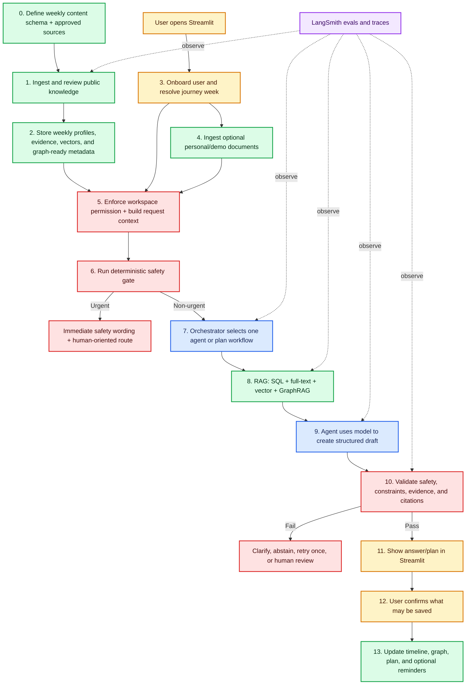
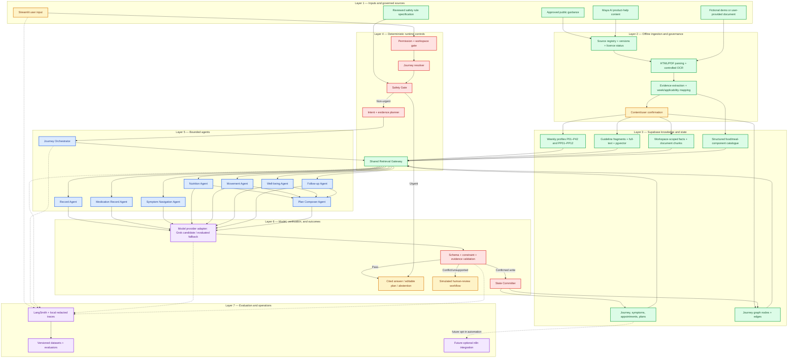
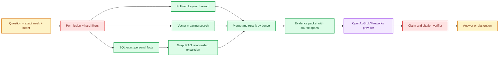

# Maya AI — Complete Product and AI Architecture

**Product:** Maya AI<br>
**Assistant:** Ask Maya<br>
**Status:** Architecture decision and build plan<br>
**Interface:** Streamlit web application<br>
**Journey:** Possible pregnancy, pregnancy weeks 1–42, and postpartum weeks 1–12<br>
**Language:** English<br>
**Updated:** 9 September 2026

> This is the canonical Maya AI architecture. It is written in implementation order so a new contributor can understand what we are building, why every component exists, and what must happen next.

> Maya AI is an educational and organizational capstone prototype. It is not a doctor, diagnostic system, prescriber, medical device, emergency service, or clinically validated product. The public demo uses fictional data and tells visitors not to upload real medical information.

## Available tools and where each one fits

Having credits does not mean every tool should be added. Maya AI should use one clear tool for each responsibility so the four-day build remains understandable, testable, and safe. The access status below comes from the team-provided credit list; every API key, quota, model, and deployment entitlement must still be verified before implementation.

| Provider/tool | Access shown | What it can do, in simple language | Maya AI decision |
|---|---|---|---|
| [xAI / Grok](https://docs.x.ai/developers/model-capabilities/text/structured-outputs) | Not confirmed in the supplied list | Generates the specialist agents' structured draft after RAG gives it trusted evidence | **Candidate model:** verify API access and benchmark it against one available fallback; it was not removed |
| OpenAI | ChatGPT Pro given | Helps team members research, reason, and code in ChatGPT | **Team-use only unless a separate API key/billing is confirmed:** ChatGPT Pro is not treated as backend API access |
| [Replit](https://docs.replit.com/build/troubleshooting) | Replit Core given | Provides a browser-based coding workspace and can deploy a Streamlit application | **Hosting/coding candidate:** evaluate separately; it does not replace Streamlit, RAG, LangGraph, or Supabase |
| [Fireworks AI](https://docs.fireworks.ai/) | Credits given | Runs open models and can provide structured generation, embeddings, and reranking | **Useful candidate:** one fallback model in the provider benchmark; optionally benchmark one embedding/reranker, but do not add several models merely to consume credits |
| [LlamaIndex / LlamaCloud](https://docs.llamaindex.ai/en/stable/module_guides/loading/ingestion_pipeline/) | 40,000 credits shown | Parses and prepares documents for RAG and can manage ingestion/retrieval workflows | **Conditional ingestion tool:** confirm what the credits cover; use only if it improves the controlled PDF/noisy-document pipeline over the simpler parser |
| [Lyzr](https://docs.lyzr.ai/introduction) | $100 credits shown | Provides another platform for building and orchestrating agents | **Do not combine with the baseline:** LangGraph already owns orchestration; use Lyzr only for a separate experiment if the core build is complete |
| [ElevenLabs](https://elevenlabs.io/docs/overview/capabilities/text-to-speech) | Free access shown | Converts approved text into spoken audio | **Deferred:** possible accessibility/read-aloud feature later; text-only English is the current capstone scope |
| [Nebius Token Factory](https://docs.tokenfactory.nebius.com/ai-models-inference/overview) | $50 credits shown | Runs open text, embedding, vision, and safety models through APIs | **Reserve fallback:** use only if the chosen Grok/Fireworks route is unavailable or a later benchmark needs one replacement candidate |
| [Pinecone](https://docs.pinecone.io/guides/search/hybrid-search) | Two months of credits shown | Stores vectors and supports semantic or hybrid document search | **Alternative, not additional:** Supabase pgvector/full-text is the baseline; use Pinecone only if the team intentionally replaces that retrieval store |
| [Mem0](https://docs.mem0.ai/open-source/overview) | Three months shown | Automatically remembers useful facts across conversations | **Do not use in the baseline:** maternal context must be explicit, confirmed, versioned, and auditable in Supabase and the journey graph |
| Composio | Not given | Connects agents to external apps and actions | **Unavailable/not required:** future calendar or messaging integration only after explicit permissions and consent design |
| Braintrust | Not given | Traces and evaluates AI systems | **Unavailable/not required:** LangSmith is already the evaluation and tracing platform |
| You.com | No credit needed | Searches the live web and can help discover source candidates | **Offline research only:** never use live web search to answer medical questions; every discovered source must pass the source registry and review gate |
| [LangChain + LangGraph](https://docs.langchain.com/oss/python/langgraph/overview) | Free access | Connects models and tools and runs the controlled multi-agent workflow | **Core:** LangGraph owns orchestration; LangChain supplies integrations and reusable components |
| [LangSmith](https://docs.langchain.com/langsmith/evaluation) | 5,000 base traces/month shown | Records every agent/RAG step and runs evaluation experiments | **Core:** use for traces, datasets, baseline-versus-improved experiments, failures, latency, and cost |
| NVIDIA / Brev | Credits not given | Provides hosted development/GPU environments | **Unavailable/not required:** no GPU environment is needed for the baseline |
| Streamlit | Open-source framework | Provides the complete chat-first web interface | **Core front end:** deployment host remains a separate decision |
| Supabase | Existing team access to confirm | Stores accounts, documents, structured facts, vectors, plans, and graph edges with permission controls | **Core data platform:** verify project credentials and RLS before document work |

### Recommended minimal stack

```text
Streamlit                         -> product interface
Supabase                         -> structured data, files, permissions, vectors, graph tables
LangChain + LangGraph            -> tools, agent contracts, and orchestration
Grok or one evaluated fallback   -> structured reasoning/generation after retrieval
LangSmith                        -> tracing, datasets, evaluation, and comparison
Python/PyMuPDF or proven parser  -> controlled document ingestion
```

Replit may host or help build the Streamlit app. Fireworks may supply the fallback model or a tested embedding/reranking model. LlamaIndex/LlamaCloud may replace only the parsing/ingestion portion if a small fixture benchmark proves a benefit. All other listed tools are deferred or alternatives, not missing architecture components.

### Access-verification checklist

Before assigning implementation work, record `available`, `unavailable`, or `unverified` for each candidate. For every API product marked available, confirm the exact API key, model/feature entitlement, remaining credit or expiry, rate limit, data-handling setting, and one successful non-sensitive test call. Keep every secret outside Git. A web subscription, playground login, or promotional-credit screenshot alone is not proof that the required server-side API is ready.

### How to use this document

- Sections 1–4: product, locked decisions, complete architecture, and weekly data.
- Sections 5–9: ingestion, storage, onboarding, synthetic documents, RAG, and GraphRAG.
- Sections 10–12: safety, agent runbooks, deterministic controls, and output validation.
- Sections 13–14: Streamlit experience, saving, plans, human review, and optional future automation.
- Sections 15–17: evaluation, failures, and pre-mortem risks.
- Sections 18–22: build order, daily checklist, demo, completion gate, and old/new decision reconciliation.

---

## 1. What are we building?

Maya AI is a week-aware maternal journey companion. A user tells Ask Maya where they are in their journey, optionally enters allergies, conditions, symptoms, appointments, and fictional demo documents, and receives a home page tailored to that week. They can ask questions, understand what their uploaded records say, create and save a weekly nutrition/movement/well-being plan, prepare questions for an appointment, and navigate symptoms safely.

Maya AI combines three types of information without mixing them:

1. **Public guidance:** reviewed, source-backed maternal-health information.
2. **Personal facts:** information the user confirms or that is extracted from their uploaded documents and then confirmed.
3. **Journey state:** possible pregnancy, exact pregnancy week, approximate month range, or postpartum week.

The AI organizes and explains this information. It does not diagnose, prescribe, or replace a professional.

### 1.1 Problem statement

Pregnancy and early-postpartum information is fragmented across prescriptions, reports, visit summaries, verbal instructions, appointments, public guidance, and different people. A generic chatbot may answer broadly but cannot reliably distinguish what a user's record documents, what the user merely reported, what a public guideline says, and what requires professional attention.

Maya AI provides a continuity layer: a confirmed change can update the user's timeline, current-week context, relevant retrieval filters, graph relationships, saved-plan status, appointment questions, and human-review packet without allowing the model to silently rewrite personal truth.

### 1.2 Users

| User | What Maya AI provides | Capstone boundary |
|---|---|---|
| Pregnant or postpartum user | Weekly education, record organization, questions, plans, symptoms, and follow-up | Primary interface |
| Person who may be pregnant | Testing/verification education and safe next-step navigation | Never assert pregnancy |
| Trusted caregiver | Explicitly shared appointments/tasks in a future version | No separate capstone interface |
| Reviewer/clinician | Consent-aware clarification packet | Simulated reviewer only |
| Evaluator | Resettable fictional scenario, evidence drawer, graph, and eval proof | No credentials or real data required |

## 2. Decisions already made

| Decision | Locked choice | Reason |
|---|---|---|
| Front end | Streamlit | Fastest way to build and deploy the complete capstone experience |
| Deployment host | Not locked: compare Streamlit Community Cloud and Replit Deployment | Hosting/coding platform is a separate implementation decision; the front end remains Streamlit |
| Permanent data | Supabase | Authentication, database, private files, pgvector, and Row Level Security in one platform |
| Orchestration | LangGraph with LangChain components | Explicit routes, bounded agent calls, retries, and visible traces |
| Observability/evals | LangSmith | Trace every route and compare prompt/model/retrieval versions |
| Model-provider status | Undecided until access and benchmark gates pass | The team never decided to remove Grok or lock OpenAI |
| Candidate provider | Grok, if xAI API access is confirmed | It fits the structured generation/tool-calling position, but must pass the same safety, quality, latency, and cost evals |
| Evaluated fallbacks | An available OpenAI API model or Fireworks-hosted model behind the same adapter | Provider choice must not require a RAG or orchestration rewrite |
| Weekly structure | Separate profile for every pregnancy and postpartum week | Week 10 and week 20 must never be treated as the same context |
| Knowledge system | One governed RAG platform with filtered shelves | Avoids duplicating ingestion and databases for every agent |
| GraphRAG | Small journey graph inside retrieval | Connects records, symptoms, restrictions, plans, evidence, and follow-ups |
| Human in loop | Simulated reviewer/clinician workflow | Demonstrates escalation honestly without claiming a real doctor service |
| Videos | Out of scope | Removed to protect time and evaluation depth |
| n8n | Optional future integration; not committed to the core capstone | It may later handle asynchronous reminders, but is unnecessary for chat, RAG, agents, safety, Streamlit, or evals |
| Fine-tuning | Only after evals show a repeated narrow failure | RAG/data/orchestration failures should not be hidden with training |
| MCP | Deferred | Typed Python tools are enough for this capstone |
| Real medical data | Prohibited in public demo | The prototype is not production-compliant |

### 2.1 Diagram color legend

All architecture flowcharts use the same meaning:

| Color | Meaning | Examples |
|---|---|---|
| Blue | AI agents or orchestrated workers | Record Agent, Nutrition Agent, Plan Composer |
| Yellow | User-facing UI or human action | Streamlit, user confirmation, simulated reviewer |
| Green | Data, sources, ingestion, retrieval, or persistent state | weekly profiles, Supabase, RAG, graph |
| Red | Deterministic safety, permission, and validation controls | Safety Gate, RLS/Permission Gate, Evidence Verifier |
| Purple | Model/provider, platform automation, tracing, or evaluation | OpenAI/Grok adapter, LangSmith, n8n |

The color indicates responsibility, not execution order. The numbered arrows define execution order.

### 2.2 Where does Grok fit?

**Grok was never removed by a team decision.** An earlier revision incorrectly converted uncertain xAI API access into a decision to exclude Grok. The correct status is: Grok remains a candidate provider if access is confirmed, while the final provider is selected by a small controlled benchmark. This corrects the architecture; it does not introduce a second RAG system.

Grok, OpenAI, or a Fireworks-hosted model would all occupy the same **model-provider position**:

```text
Retrieved evidence + personal facts + current week
                         ↓
     Provider adapter: Grok candidate OR evaluated fallback
                         ↓
               Structured draft response
                         ↓
          Safety, evidence, and citation checks
```

The model does not:

- create the authoritative weekly dataset;
- decide which user owns a document;
- store records;
- perform database permissions;
- replace retrieval;
- become the source for an uncited medical statement.

Grok sits **after** safety classification and evidence retrieval, inside a bounded specialist-agent call. It receives the current journey state, authorized personal context, and retrieved source passages, then returns a typed draft. It may also be benchmarked for offline structured extraction from fictional documents. It is not the source of medical knowledge, the retriever, the Safety Gate, GraphRAG, the database, or a direct state writer.

Basic maternal-health questions still require governed retrieval; Grok must not answer them from model memory. Only deterministic product-help questions may bypass medical RAG. If xAI access is unavailable or Grok fails a release gate, the same provider adapter uses the best evaluated available OpenAI or Fireworks model without changing the rest of the pipeline.

#### Provider-selection gate

Before implementation is tied to one provider:

1. confirm a usable server-side API key, model ID, rate limits, and billing for every candidate actually tested;
2. run the same frozen development cases through each candidate with identical evidence packets and output schemas;
3. compare schema-validity rate, unsupported-claim rate, citation faithfulness, boundary compliance, latency, and measured cost;
4. choose one primary provider and one fallback only after recording the result;
5. never send real medical data during the capstone benchmark.

This is a small provider benchmark, not a multi-provider production router. The capstone uses one selected provider at runtime.

### 2.3 Platform-fit verification

- [Streamlit Community Cloud](https://docs.streamlit.io/deploy/streamlit-community-cloud/deploy-your-app/deploy) and [Replit Deployment](https://docs.replit.com/build/troubleshooting) can both host the Streamlit entrypoint. The team must test secrets, startup, logs, reset behavior, and public access before selecting one; hosting is not yet locked.
- [Supabase](https://supabase.com/docs/guides/database/overview) provides Postgres, Row Level Security, Storage integration, and pgvector support. Its [hybrid-search guidance](https://supabase.com/docs/guides/ai/hybrid-search) uses Postgres full-text search plus pgvector, matching the Retrieval Gateway.
- [LangGraph](https://docs.langchain.com/oss/python/langgraph/overview) is designed for stateful workflows, durable execution, and human-in-the-loop control; we use a mostly predetermined workflow with bounded agent nodes, not an unrestricted autonomous loop.
- [LangSmith evaluation](https://docs.langchain.com/langsmith/evaluation-quickstart) separates dataset, target function, and evaluators; Maya AI's eval plan follows that structure and evaluates both individual nodes and complete graph runs.
- [Grok structured outputs](https://docs.x.ai/developers/model-capabilities/text/structured-outputs) support schema-constrained responses and tool-call arguments on supported models, which fits Maya AI's typed agent contracts. Access and capability still do not prove safety or quality; the provider benchmark remains mandatory.

---

## 3. The complete architecture in implementation order

This is the one pipeline the team should follow.



### Pipeline responsibility table

| Step | What happens | Main technology | Output |
|---:|---|---|---|
| 0 | Define what one week record contains and which sources are allowed | JSON/Pydantic schemas | Empty weekly templates and source registry |
| 1 | Extract candidate evidence, attach week/applicability metadata, review it | Python, PyMuPDF/HTML parser, optional LLM extraction | Approved evidence fragments |
| 2 | Save structured content, searchable chunks, embeddings, and relationship metadata | Supabase/Postgres/pgvector | Published corpus version |
| 3 | Collect due date/week/month/delivery date and resolve the current stage | Streamlit + deterministic Python | Versioned journey state |
| 4 | Parse optional fictional demo documents and ask the user to confirm extracted facts | Supabase Storage, parser/OCR, structured extraction | Confirmed personal facts + document chunks |
| 5 | Derive workspace permission from the session, then assemble week, facts, symptoms, records, saved plans, and question | Supabase RLS + Python service layer | Authorized typed request context |
| 6 | Check urgent patterns before generative reasoning | Deterministic rules | Safe, urgent, or clarify route |
| 7 | Pick the smallest required specialist workflow | LangGraph | Agent execution plan |
| 8 | Retrieve exact facts and supporting passages; traverse relevant graph edges | SQL, full text, pgvector, GraphRAG | Evidence packet |
| 9 | Turn the evidence packet into a structured answer or plan contribution | Selected model through provider adapter; Grok remains a candidate pending access and benchmark | Draft schema |
| 10 | Reject unsafe, conflicting, wrong-week, or unsupported content | Pydantic + rules + evidence verifier | Approved output or failure route |
| 11 | Render provenance, citations, actions, and limitations | Streamlit | User-visible result |
| 12 | Ask before saving extracted facts, plans, reminders, or handoff packets | Streamlit | Explicit consent/action |
| 13 | Persist the confirmed change and mark affected outputs stale | Supabase + graph updates | Updated continuity state |

### 3.1 Layered component architecture

The numbered pipeline above explains **when** things happen. This diagram explains **where every component belongs**. It reconciles the useful layered view from the earlier source-of-truth document with the current Streamlit/Supabase architecture.



The model is deliberately late in the diagram. Permission, journey resolution, safety, routing, and retrieval happen before it; validation happens after it. No provider may write state directly.

---

## 4. Stage 0 — Create a genuinely weekly content system

### 4.1 Is the source material actually week-wise?

Partly.

- Pregnancy, Birth and Baby has a weeks 1–4 page and individual pages for weeks 5–40.
- The NHS has individual pregnancy content from week 4 through week 41.
- MedlinePlus helps explain gestational dating and why weeks 1–2 require careful language.
- WHO, ICMR-NIN, and many movement/mental-health guidelines are **not weekly**. Their advice applies across a wider period or depends on symptoms, conditions, or professional clearance.
- Postpartum guidance is often organized around the first 24 hours, day 3, days 7–14, week 6, or general recovery—not a unique article for every week through week 12.

Therefore, Maya AI must not claim that every domain changes every week. The product has a separate weekly profile, but stable evidence may appear in consecutive weeks when its real applicability has not changed.

### 4.2 Final dataset strategy: layered, not one giant PDF

Maya AI must not choose between “WHO rules” and “a week-wise PDF.” They solve different problems and are required together. WHO is a strong authority for care principles, recommendations, timing, and boundaries, but it is not a complete source for 42 unique pregnancy pages and 12 unique postpartum pages. A week-by-week source can support the weekly experience, but it must not replace authoritative clinical guidance or become personalized medical advice.

The approved design uses four clearly separated layers:

| Dataset layer | What it contains | Best source type | Runtime use |
|---|---|---|---|
| Weekly journey layer | Week-specific development, possible body changes, neutral preparation, and hero-card evidence | Official/public-health week-by-week pages with recorded reuse terms | Builds the exact-week home experience |
| Guideline layer | Nutrition, movement, antenatal/postnatal care, mental well-being, and source-defined timing or eligibility | WHO, ICMR-NIN, NHM, and other approved authorities | Supplies cited reusable evidence fragments |
| Personal-context layer | User-entered facts plus confirmed facts extracted from fictional demo documents | The current isolated workspace only | Filters and personalizes without becoming public knowledge |
| Safety-rule layer | Reviewed red-flag patterns, fixed urgent wording, and escalation behavior | Separately reviewed safety specification | Runs before any generative model |

The weekly page is an assembly, not a newly generated medical dataset:

```text
exact weekly profile
  + applicable guideline fragments
  + confirmed personal context
  + current symptoms and restrictions
  + appointment and saved-plan state
= the user's current evidence packet and dashboard
```

#### What “complete dataset” means for this capstone

- Create addressable schema shells and a coverage row for every `P01`–`P42` and `PP01`–`PP12` profile.
- Deeply source, review, publish, and evaluate only the representative profiles listed in Section 19.
- Keep every unreviewed profile unpublished; never fill a gap with model memory or invented weekly variation.
- Allow the same reviewed nutrition, movement, or well-being fragment to apply across adjacent weeks when its source says the guidance is stable.
- Keep early-postpartum day overlays because authoritative postnatal timing is often day-based rather than uniquely weekly.
- Treat `P42` as representable state but do not publish a generic wellness card without reviewed local wording.

This scope is technically strong because it proves schema coverage, retrieval filters, provenance, safety, orchestration, and evaluation without pretending the team clinically curated 54 complete care guides in four days.

#### PDF and webpage rule

Do not search for or depend on one “complete pregnancy PDF.” Official information is legitimately fragmented across PDFs and HTML pages. Ingest only the exact sections needed, preserve their canonical URL/page/anchor, record jurisdiction and reuse terms, and map each evidence unit to its real applicability. A PDF is not automatically more authoritative than an official maintained webpage.

### 4.3 Weekly records we will create

| Record family | IDs | Count | Purpose |
|---|---|---:|---|
| Possible pregnancy | `PC00` | 1 | Verification and next-step education without assuming pregnancy |
| Pregnancy weeks | `P01`–`P42` | 42 | One addressable record for each gestational week |
| Postpartum weeks | `PP01`–`PP12` | 12 | One addressable record for each postpartum week |
| Early postpartum days | `PPD0`–`PPD7` | 8 | Day-specific safety/follow-up additions during postpartum week 1 |

`P13` and `P14` are different records. They may reference the same reviewed hydration fragment, but each has its own weekly hero, development/body information, preparation items, and applicable fragment list.

### 4.4 What one weekly profile contains

```json
{
  "profile_id": "P10",
  "stage": "pregnancy",
  "week": 10,
  "status": "draft | reviewed | published",
  "hero": {
    "title": "source-backed weekly title",
    "development_evidence_ids": [],
    "visual_asset_id": null
  },
  "card_slots": {
    "what_may_change": [],
    "nutrition_focus": [],
    "movement_focus": [],
    "wellbeing_focus": [],
    "symptom_education": [],
    "preparation": [],
    "consider": [],
    "avoid": [],
    "ask_a_professional": []
  },
  "guidance_fragment_ids": [],
  "source_evidence_ids": [],
  "jurisdiction": ["GLOBAL", "IN"],
  "reviewed_by": null,
  "version": "1.0.0"
}
```

### 4.5 Reusable guidance fragment

A fragment is one small, source-backed claim or action that can be safely reused.

```json
{
  "fragment_id": "movement_general_001",
  "domain": "movement",
  "applies_to": {
    "stage": "pregnancy",
    "week_start": 8,
    "week_end": 20,
    "conditions_required": [],
    "conditions_excluded": []
  },
  "text": "reviewed paraphrase",
  "evidence_span_ids": ["WHO_PA_PAGE_X"],
  "jurisdiction": "GLOBAL",
  "review_status": "reviewed"
}
```

This prevents duplicate storage while keeping the user experience weekly. The source decides the applicability range; the LLM does not invent it.

### 4.6 Month-only input

If the user knows only a month, Maya AI stores an approximate range:

| Month | Approximate week range |
|---:|---|
| 1 | 1–4 |
| 2 | 5–8 |
| 3 | 9–13 |
| 4 | 14–17 |
| 5 | 18–22 |
| 6 | 23–27 |
| 7 | 28–31 |
| 8 | 32–35 |
| 9 | 36–40+ |

Maya AI does not secretly select a week. It displays the range and retrieves only information supported across that range. Exact weekly claims require an estimated due date or user-provided week.

### 4.7 Source coverage plan

| Content need | Primary source candidate | Weekly behavior |
|---|---|---|
| Possible pregnancy and pregnancy weeks 1–3 | [MedlinePlus fetal development](https://medlineplus.gov/ency/article/002398.htm) plus approved testing/verification guidance | Explain gestational dating and safe next steps; do not imply conception, implantation, or confirmed pregnancy for an individual |
| Pregnancy weeks 4–41 | [NHS week-by-week guide](https://www.nhs.uk/best-start-in-life/pregnancy/week-by-week-guide-to-pregnancy/) | Candidate backbone for exact-week development/body-change evidence; record reuse terms and do not import UK care schedules as Indian schedules |
| Pregnancy weeks 1–40 coverage cross-check | [Pregnancy, Birth and Baby week-by-week index](https://www.pregnancybirthbaby.org.au/pregnancy/pregnancy-stages/pregnancy-week-by-week) | Reference/coverage candidate only unless reuse permission or a compatible licensed route is confirmed; do not copy into embeddings by default |
| Gestational dating | [MedlinePlus fetal development](https://medlineplus.gov/ency/article/002398.htm) | Supports possible-pregnancy and early-week wording |
| Week 41 and at/beyond term | [NHS week 41](https://www.nhs.uk/best-start-in-life/pregnancy/week-by-week-guide-to-pregnancy/3rd-trimester/week-41/) + [WHO recommendations at or beyond term](https://www.who.int/publications/i/item/9789240052796) | Professional-follow-up education only; do not turn a guideline for professionals into personalized treatment advice |
| Consolidated maternal recommendations | [WHO maternal-health recommendations, edition 2](https://www.who.int/publications/b/59332) | Current recommendation/version cross-check rather than weekly hero content |
| Antenatal guidance | [WHO antenatal-care recommendations](https://www.who.int/publications/i/item/9789241549912/) | Create fragments with real applicability; do not force into fake weekly changes |
| Antenatal data/workflow model | [WHO Antenatal Care Digital Adaptation Kit](https://iris.who.int/bitstream/handle/10665/339745/9789240020306-eng.pdf) | Candidate data elements, workflow logic, and terminology; not consumer-facing copy |
| India nutrition | [ICMR-NIN Dietary Guidelines for Indians 2024](https://www.nin.res.in/dietaryguidelines/pdfjs/locale/DGI07052024P.pdf) | Nutrition fragments mapped to weeks only when the evidence supports it |
| Movement | [WHO physical-activity guidance](https://iris.who.int/bitstream/handle/10665/336656/9789240015128-eng.pdf) | General fragments plus personal restrictions/symptoms; never infer clearance |
| Perinatal well-being | [WHO perinatal mental-health guide](https://www.who.int/publications/i/item/9789240057142) | Stage-appropriate support and escalation fragments, not weekly diagnosis |
| Postpartum | [WHO postnatal-care guideline](https://www.who.int/publications/i/item/9789240045989) | Map source-defined timing to PP profiles; repeat stable guidance honestly |
| Postpartum data/workflow model | [WHO Postnatal Care Digital Adaptation Kit](https://www.who.int/publications/i/item/9789240090347) | Candidate postpartum workflow/data elements; not a replacement for guideline passages |
| Postnatal timing | [WHO maternal intervention timing](https://www.who.int/teams/maternal-newborn-child-adolescent-health-and-ageing/handbooks/programme-manager-s-handbook-mncah/recommendations-on-interventions-along-life-course/maternal) | Supports day 0, day 3, days 7–14, and week 6 additions |
| India care-source registry | [National Health Mission maternal-health guidelines](https://www.nhm.gov.in/index1.php?lang=1&level=3&lid=377&sublinkid=839) | Locate and version exact India-specific documents; the registry page itself is not the corpus |
| Safety taxonomy | [CDC urgent maternal warning signs](https://www.cdc.gov/hearher/maternal-warning-signs/index.html) plus locally reviewed policy | Used to design safety rules/evals, not copied blindly into India deployment |

`P42` exists in the schema so the system can represent the user's reported/calculated state, but it must remain unpublished until its exact content and local care wording are reviewed. The app should prioritize contacting the user's maternity professional rather than generate a generic week-42 wellness page.

The Pregnancy, Birth and Baby guide demonstrates that exact-week coverage exists, but its current terms restrict reproduction. Treat it as a coverage/reference candidate unless written reuse permission or a compatible licensed route is confirmed; do not copy its pages into embeddings by default. Record and follow the NHS and every other publisher's reuse/attribution terms separately. If the NHS reuse check fails, replace it with another approved weekly source rather than using Grok to manufacture the missing week.

### 4.8 Source rules

- Store title, owner, jurisdiction, publication/update date, source version, URL, reuse/license status, approved sections, reviewer, and retirement status.
- Do not ingest a source merely because it is authoritative; confirm its reuse terms.
- Every displayed medical/health claim links to an evidence span.
- Preserve the source's true applicability. “Relevant in pregnancy” does not automatically mean “new in week 10.”
- Foreign appointment schedules remain jurisdiction-labeled and do not become Indian care instructions.
- No live medical web search during user answers.
- Updating a source creates a new corpus version and reruns regression evals.
- A publisher landing page is registry metadata, not automatically the corpus; ingest the exact downloadable document or selected webpage sections that contain the evidence.

Exclude search snippets, influencer posts, forums, generic wellness blogs, unrestricted web/X search, random transcripts, commercial product pages, autonomous medication-dose sources, real patient records, and any source whose publisher/version/jurisdiction cannot be verified.

### 4.9 Evidence lanes

These lanes prevent the system from treating every piece of text as the same kind of truth.

| Lane | Contains | Can support | Must not become |
|---|---|---|---|
| Personal record | Uploaded fictional/demo documents and confirmed extracted facts | “Your record says,” timeline, changes, appointment preparation | General medical authority |
| User report | Information typed by the user | Context, follow-up, and routing | Confirmed diagnosis or clinician instruction |
| Guideline | Approved public evidence | General cited education | Personalized diagnosis/treatment |
| Weekly profile | Reviewed configuration and week-specific evidence links | Dashboard and exact-week context | Evidence without underlying source spans |
| Safety | Reviewed deterministic rule specification | Pre-generation urgent routing | Autonomous clinical triage/diagnosis |
| Product help | Maya AI usage instructions | How to upload, edit, save, reset, or delete | Medical guidance |

### 4.10 Source-registry record

Every external source must have:

```text
source_id
title
publisher
canonical_url
jurisdiction
publication_date
version_or_last_update
last_checked_at
document_type
journey_stage
topics
evidence_lane
selected_sections_or_anchors
allowed_use
prohibited_inferences
status: candidate | approved_for_capstone | excluded | superseded
supersedes_source_id
license_or_reuse_note
reviewer_status
content_checksum
```

Do not use the label `clinically_approved`. Use `content_reviewed` or `clinician_reviewed` only when the named review actually occurred.

---

## 5. Stage 1 — Public-knowledge ingestion, in plain language

Ingestion means turning a page/PDF into small, traceable evidence units the system can safely search.

```mermaid
flowchart LR
    A["1. Register source"]:::data --> B["2. Save approved version"]:::data
    B --> C["3. Parse headings/tables/text"]:::data
    C --> D["4. Create candidate evidence units"]:::data
    D --> E["5. Attach domain, week range, stage, jurisdiction"]:::data
    E --> F["6. Human review"]:::human
    F -->|Rejected| D
    F -->|Approved| G["7. Link evidence to weekly profiles"]:::data
    G --> H["8. Create search text + embedding"]:::data
    H --> I["9. Run ingestion tests"]:::control
    I -->|Pass| J["10. Publish corpus version"]:::data

    classDef human fill:#FEF3C7,stroke:#D97706,color:#78350F,stroke-width:2px;
    classDef data fill:#DCFCE7,stroke:#16A34A,color:#14532D,stroke-width:2px;
    classDef control fill:#FEE2E2,stroke:#DC2626,color:#7F1D1D,stroke-width:2px;
```



### Exact implementation steps

1. Add an approved URL/PDF to `source_registry`.
2. Save the specific version/date so future website changes do not silently change answers.
3. Parse HTML by headings or PDF by page/section using Python and PyMuPDF/HTML parsing.
4. Remove headers/navigation while preserving meaning, page number, heading, and exact source text.
5. Optionally use the model to propose structured fields; treat them as candidates, not truth.
6. Validate candidates with Pydantic schemas.
7. A reviewer confirms domain, stage, exact week/applicability range, wording, jurisdiction, and evidence span.
8. Link approved evidence/fragments to the applicable weekly profiles.
9. Store the original text for citation, normalized text for search, and one embedding per approved unit.
10. Test missing citations, invalid week ranges, duplicate units, unsupported profile links, and license/review status.
11. Publish only passing records under a version such as `corpus_2026_09_09_v1`.

**The model can help format source content, but it cannot decide medical truth or manufacture weekly guidance from a broad PDF.**

---

## 6. Stage 2 — Storage: where every kind of data lives

| Data type | Supabase location | Why |
|---|---|---|
| Accounts and access | Supabase Auth + Row Level Security | Prevent one user from seeing another user's data |
| Journey/week | `journey_states` | Exact, deterministic lookup |
| Weekly cards | `weekly_profiles` | One record per week |
| Reusable public evidence | `guidance_fragments` and `guideline_chunks` | Search, citations, and reuse |
| Embeddings | pgvector columns | Semantic retrieval |
| Uploaded files | Private Supabase Storage bucket | Original document and ownership |
| Extracted facts | `document_facts`, `health_facts`, `medication_mentions` | Exact SQL queries and confirmation status |
| Symptoms | `symptom_events` | Safety and timeline |
| Appointments/questions | `appointments`, `appointment_questions` | Follow-up workflow |
| Plans | `plans`, `plan_items` | Draft/saved/versioned/stale state |
| Relationships | `graph_nodes`, `graph_edges` | GraphRAG continuity |
| Human review | `human_review_cases` | Honest pending/resolved/unavailable status |
| Notifications | `notifications` | Consent, idempotency, retries, delivery status |
| Feedback/eval links | `feedback` | Connect UX feedback to a LangSmith trace |

### Data security rules

- A personal workspace starts empty.
- Demo data lives under a separate, visibly fictional workspace.
- V1 workspaces are owner-only. Collaboration requires a future capability-matrix migration and tests before any non-owner role is enabled.
- One workspace is one pregnancy-through-postpartum care episode. A later pregnancy uses a new workspace.
- Every user-owned table has Row Level Security.
- Every personal vector query includes the authenticated workspace filter at database level.
- User operations use the user's Supabase access token. Never use the service-role key for ordinary chat/retrieval because it can bypass Row Level Security.
- Keep any service-role key server-side and restrict it to explicit administrative ingestion tasks.
- Deleting a document also deletes derived facts, chunks, graph edges, and cached summaries.
- LangSmith traces contain synthetic or redacted data only.
- Cross-user leakage blocks release.

---

## 7. Stage 3 — Onboarding and journey resolution

### Streamlit onboarding flow

1. Show what Maya AI can/cannot do and the public-demo privacy warning.
2. Ask the user to choose Personal Empty Workspace or Fictional Demo Mode.
3. Ask where they are: may be pregnant, pregnant, or postpartum.
4. Present one timing dropdown:
   - estimated due date — recommended;
   - current gestational week and optional day;
   - approximate pregnancy month;
   - delivery date;
   - current postpartum week.
5. Resolve timing with deterministic Python—not an LLM.
6. Display the calculated week/range and ask the user to confirm it.
7. Optionally collect allergies, medical history/conditions, restrictions, current symptoms, and appointments.
8. Optionally upload fictional demo documents.
9. Ask the user to confirm extracted information before it becomes active context.
10. Open the weekly home page.

### Timing rules

- Estimated due date calculates gestational week/day and stores calculation date.
- Week/day stores a user-reported value and effective date.
- Month stores only an approximate range.
- Delivery date calculates postpartum day/week.
- Conflicting due date and week are displayed together and require confirmation; the system never silently chooses.
- The week rolls forward deterministically with time.
- Weeks 1–2 and “may be pregnant” use careful dating/verification language and do not assert a confirmed pregnancy.
- Dating priority is: user-confirmed estimate from a dated clinical document, then user-confirmed estimated due date, then manually entered week/day, then approximate month range. A disagreement creates `dating_conflict`; Maya AI does not adjudicate it.
- Symptoms entered during onboarding are stored as time-stamped symptom events, not timeless permanent facts.

---

## 8. Stage 4 — Personal documents and the synthetic demo profile

### 8.1 Do we need a synthetic profile?

Yes—for repeatable demonstration and evaluation—but it must be isolated.

- **Personal Mode:** always empty for a first-time user.
- **Demo Mode:** one clearly labeled fictional persona with fictional documents, cloned into a session-specific demo workspace.
- **Tests:** additional synthetic fixtures that never appear in the user's workspace.

The synthetic profile is not medical knowledge and is not placed in public RAG. It exists only to prove personalization, extraction, conflict handling, GraphRAG, saved plans, and human review.

Do not let every evaluator mutate one global demo record. Each demo session gets a unique workspace copied from the same seed and may reset only that copy. This makes concurrent demos reproducible.

### 8.2 Recommended fictional demo package

Create a coherent fictional case containing:

- journey state and estimated due date;
- one confirmed food allergy;
- one clinician-recorded movement restriction;
- one appointment date;
- one short fictional prescription/visit note;
- one fictional report with a follow-up item;
- one deliberately contradictory or low-confidence document field;
- one existing saved plan that becomes stale after the new record is confirmed.

Use invented names and values. Add a visible `FICTIONAL DEMO DATA` watermark. Do not imitate or modify a real person's documents.

Recommended fixture inventory:

| ID | Fictional document | What it proves |
|---|---|---|
| `DOC-001` | Pregnancy intake summary | Starts the fictional journey and baseline facts |
| `DOC-002` | Baseline laboratory report | Structured extraction without diagnosis |
| `DOC-003` | Prescription/instruction note | Establishes a documented medication instruction |
| `DOC-004` | Routine visit summary | Updates timing without overwriting history |
| `DOC-005` | Movement guidance note | Establishes an initially permitted activity category |
| `DOC-006` | Later visit summary | Adds a restriction and a deliberate instruction conflict |
| `DOC-007` | Follow-up instruction | Creates appointment and clarification tasks |
| `DOC-008` | Postpartum discharge summary | Demonstrates pregnancy-to-postpartum transition |

Every fixture needs editable source text, a watermarked PDF, expected extraction JSON, expected graph changes, and intended eval cases. Create one controlled noisy/OCR variant; do not create dozens of decorative PDFs.

### 8.3 Personal-document ingestion

1. Authenticate and assign the file to the workspace.
2. Validate file format, size, password/lock status, and malware policy.
3. Save the original in a private bucket.
4. Parse text; use OCR only if the PDF is image-based.
5. Classify document type using a small structured model call.
6. Extract candidate facts: dates, clinician, medication mention, instruction, allergy, condition, appointment, test, and follow-up.
7. Preserve page and exact text span for every extracted fact.
8. Assign extraction confidence/completeness metadata.
9. Show significant or uncertain fields to the user for confirmation.
10. Save confirmed facts in SQL; save permitted text chunks in the personal vector collection.
11. Create graph nodes/edges and detect conflicts without overwriting older facts.
12. Mark affected dashboard cards/plans stale and show what changed.

Text inside a document is untrusted content. “Ignore previous instructions” in a PDF is stored as text and never changes system policy.

### 8.4 Fact states

| Status | Meaning | May personalize output? |
|---|---|---|
| `not_provided` | No information supplied | No; never interpret as “none” |
| `user_reported` | Entered directly by user | Yes, with “you reported” wording |
| `document_extracted` | Model/parser proposal awaiting review | No |
| `user_confirmed` | User accepted extracted fact | Yes, with record provenance |
| `conflicted` | Two sources disagree | No automatic resolution; create clarification route |
| `superseded` | Explicitly replaced by newer confirmed information | Historical use only |
| `human_reviewed` | Reviewer response recorded | Yes, with reviewer identity/status visible |

Every personal object stores `workspace_id`. The authenticated owner and care
episode are derived through that workspace; child tables do not duplicate
`owner_id` or `episode_id`. Each record stores timestamps, provenance and a state
version where its workflow needs them. This V1 decision is recorded in
`docs/decisions/0003-owner-only-workspace-care-episode.md`.

---

## 9. Stage 5 — RAG explained simply

### 9.1 What RAG means here

Think of RAG as a librarian:

1. The user asks a question.
2. Maya AI first identifies the exact week, domain, and personal context.
3. The librarian retrieves only the most relevant approved public passages and permitted personal facts.
4. The model writes an answer using that evidence.
5. A verifier checks whether the answer is actually supported.

The model is the writer, not the library.

### 9.2 Why we are not building one database per agent

All agents use one Retrieval Gateway, but each sends a different filter:

| Agent | Public shelf | Personal context |
|---|---|---|
| Record | None unless explanation needs public context | Uploaded document chunks and confirmed facts |
| Medication Record | Medication-related document spans | Medication mentions, dates, instructions, conflicts |
| Symptom Navigation | Approved symptom/safety guidance | Current week, symptoms, restrictions, recent events |
| Nutrition | Nutrition evidence valid for the current week/range | Allergies, conditions, symptoms, saved preferences |
| Movement | Movement evidence valid for the current stage | Restrictions, symptoms, recorded clearance/status |
| Well-being | Approved perinatal well-being guidance | Check-ins, stage, prior follow-up state |
| Follow-up | Care-preparation/follow-up guidance | Appointments, open questions, record changes |

Separate infrastructure for every agent would duplicate documents, embeddings, permissions, updates, and evals. Logical shelves and hard filters give specialization without seven disconnected RAG systems.

### 9.3 Exact retrieval pipeline



Step by step:

1. Convert the question to a typed request: domain, exact week/range, stage, jurisdiction, and allowed source scope.
2. Apply hard filters before semantic search. A pregnancy-week-10 nutrition request cannot retrieve postpartum or week-30-only evidence.
3. Query SQL for exact personal facts; do not use vector search to guess an appointment date or allergy.
4. Run Postgres full-text search for matching terms.
5. Run pgvector search for semantically similar approved passages.
6. Run bounded GraphRAG traversal for connected restrictions, conflicts, superseded facts, plans, appointments, and evidence.
7. Merge and rerank by authority, applicability, source version, exact-week fit, and relevance.
8. Return an evidence packet with IDs, source spans, and provenance labels.
9. Give only that packet plus necessary state to the model.
10. Verify each material claim and citation. Retry retrieval once if the wrong evidence was found; otherwise abstain or escalate.

### 9.4 Evidence Packet contract

The Retrieval Gateway never sends a loose pile of text to an agent. It returns this typed packet:

```json
{
  "request_id": "traceable-id",
  "workspace_id": "server-derived-scope",
  "question": "user question",
  "journey_stage": "pregnancy",
  "exact_week": 10,
  "risk_result": "non_urgent",
  "personal_facts": [],
  "personal_passages": [],
  "weekly_profile": {},
  "guideline_passages": [],
  "graph_paths": [],
  "missing_information": [],
  "conflicts": [],
  "allowed_claim_types": [],
  "required_citations": []
}
```

`workspace_id` comes from the authenticated session. Neither the user prompt nor the model can choose or override it.

### 9.5 When GraphRAG enters the pipeline

GraphRAG is part of **Step 6 inside retrieval**. It is not a separate final feature.

Vector search answers: “Which passages discuss this question?”

GraphRAG answers: “Which known facts and actions are connected for this user?”

Example:

```text
Week P24
  -> current symptom event
  -> clinician-recorded movement restriction
  -> restriction constrains movement plan item
  -> new document supersedes an older instruction
  -> change marks saved weekly plan stale
  -> unresolved conflict creates a question for next appointment
```

Use these node types: `Person`, `JourneyState`, `WeeklyProfile`, `Document`, `DocumentFact`, `MedicationMention`, `Allergy`, `Condition`, `SymptomEvent`, `Appointment`, `Plan`, `PlanItem`, `GuidelineEvidence`, `Question`, and `HumanReviewCase`.

Use these edge types: `IN_WEEK`, `EXTRACTED_FROM`, `CONFLICTS_WITH`, `SUPERSEDES`, `CONSTRAINS`, `SUPPORTED_BY`, `TRIGGERED`, `SCHEDULED_FOR`, `NEEDS_CLARIFICATION`, and `REVIEWED_BY`.

For the capstone, store graph nodes/edges in Postgres and traverse them with bounded Python queries. Do not add Neo4j. A NetworkX visualization may show the graph to evaluators, but it is not the source of truth.

### 9.6 Load and cost control

- Precompute and cache published weekly home profiles.
- Do not run RAG or agents merely to open the dashboard.
- Embed approved public evidence once per corpus version.
- Use SQL for exact facts and vectors only for passage discovery.
- Ordinary questions invoke one specialist agent.
- Only full-plan generation runs several specialists in parallel.
- Limit retrieval count, graph depth, agent steps, model calls, tokens, and total latency.
- Cache only non-personal public retrieval results by question, week/range, domain, jurisdiction, and corpus version.
- Set a daily model-spend alert/cap and show per-scenario cost from traces; do not publish a cost claim until measured with the selected model.

### 9.7 Model-call budget

| Request type | Maximum baseline model calls |
|---|---:|
| Deterministic product help | 0 |
| Urgent route before immediate safety message | 0 |
| Simple grounded question | 1 specialist generation |
| Ambiguous grounded question | 1 routing/classification + 1 specialist generation |
| Document upload | 1 structured extraction before user confirmation |
| Full weekly plan | Up to 4 specialist calls in parallel + 1 composition call |
| Validation repair | At most 1 bounded repair/retrieval retry |

Every model call records provider/model version, schema version, evidence IDs, latency, tokens, estimated cost, retry count, and trace ID.

---

## 10. Stage 6 — Safety before agents

The Safety Gate is a deterministic control, not an LLM agent.

It runs on:

- onboarding symptom text;
- every chat message;
- symptom check-ins;
- extracted document facts;
- plan-generation inputs.

Possible results:

1. `urgent`: stop the normal agent flow and show reviewed emergency-oriented wording.
2. `needs_clarification`: ask the minimum safety question; if safety remains unclear, escalate.
3. `non_urgent`: continue to the orchestrator.

The model may help understand phrasing, but it cannot downgrade a deterministic urgent match. The capstone uses a locally reviewed synthetic red-flag test set and does not claim clinical validation.

---

## 11. Stage 7 — Orchestration and every agent's workflow

An agent is a bounded workflow with a trigger, tools, structured output, and stop rule. Agents do not own separate databases and do not call one another directly. The orchestrator coordinates them through shared typed state.

Every agent implementation must define: trigger, typed input, allowed tools, retrieval policy, model instructions, typed output, prohibited behavior, stop/escalation conditions, call/retry budget, evaluation cases, and trace fields.

### Agent catalogue and implementation contract

| Agent | Trigger | Allowed tools/evidence | Typed output | Budget | Key evaluation |
|---|---|---|---|---:|---|
| Journey Orchestrator | Non-urgent request after context building | Intent classifier, agent registry, current state | Route plan and reason | 1 routing call | Correct agent; unnecessary-agent rate |
| Record Agent | Record question/upload extraction review | Personal SQL/chunks, source spans, conflict checker | Record summary/proposed facts | 1 call | Exact record fidelity and abstention |
| Medication Record Agent | Medication-record question/conflict | Medication facts/spans/timeline | “Documented as” timeline and questions | 1 call | No prescribing; conflict recall |
| Symptom Navigation Agent | Non-urgent symptom request | Safety result, symptom evidence, user report | Bounded route and next action | Up to 1 clarify + 1 answer | Red-flag handback and no diagnosis |
| Nutrition Agent | Nutrition question/plan | Nutrition shelf, weekly profile, structured food catalogue, constraints | Answer or plan contribution | 1 call | Allergy/restriction compliance |
| Movement Agent | Movement question/plan | Movement shelf, weekly profile, restrictions/symptoms | Answer or plan contribution | 1 call | No inferred clearance |
| Well-being Agent | Well-being question/check-in | Well-being shelf, stage, prior check-ins | Supportive action/follow-up | 1 call | Acute safety routing and no diagnosis |
| Follow-up Agent | Appointment/task/brief request | Timeline, appointments, conflicts, open questions | Prioritized organizational tasks | 1 call | Confirmed-source dependency |
| Plan Composer Agent | Full weekly plan after specialists | Validated specialist schemas | Editable plan, conflicts, save eligibility | 1 composition call | Cross-agent consistency |

### 11.1 Journey Orchestrator Agent

**Purpose:** decide what workflow is needed and keep it bounded.

1. Receive safe request context from the Safety Gate.
2. Classify intent: record, medication record, symptom, nutrition, movement, well-being, follow-up, full plan, or out of scope.
3. Decide whether one specialist is enough.
4. Create a typed execution plan with maximum steps/tool calls.
5. Send only necessary context to the specialist.
6. Collect structured output.
7. Route it to validators and response composition.
8. Stop on unsupported intent, tool budget, conflicting agents, or validation failure.

### 11.2 Record Agent

**Purpose:** explain what an uploaded record actually documents.

1. Identify the record/question and authenticated workspace.
2. Retrieve document facts and exact page/span evidence.
3. Distinguish confirmed, unconfirmed, and conflicting fields.
4. Create a plain-language summary using “this document says.”
5. Show source page/span and uncertainty.
6. Offer actions: confirm fact, correct extraction, add appointment question, or request human clarification.
7. Never infer a diagnosis or treatment beyond the document.
8. Stop when OCR is poor, the record is missing, or documents conflict.

### 11.3 Medication Record Agent

**Purpose:** organize medication information without giving medication advice.

1. Retrieve medication mentions, dates, document spans, and confirmation state.
2. Build a chronological “recorded as” timeline.
3. Compare current and older instructions.
4. Detect missing dose/frequency or contradictory records.
5. Explain only what is documented.
6. Create a clarification question for the professional when necessary.
7. Refuse requests to start, stop, substitute, or change medication.
8. Escalate conflicts, unclear instructions, or safety concerns.

### 11.4 Symptom Navigation Agent

**Purpose:** help the user choose a safe next step, not diagnose.

1. Receive only after the first Safety Gate pass.
2. Ask minimal structured questions: symptom, onset, severity, duration, change, and relevant context.
3. Rerun the Safety Gate with the new details.
4. Retrieve approved evidence for the exact stage/week.
5. Classify the route as urgent, professional follow-up, monitor/track, or insufficient information.
6. Explain the route without naming an unconfirmed condition.
7. Offer tracking or a handoff summary.
8. Never provide unsafe reassurance; escalate if uncertainty prevents a safe route.

### 11.5 Nutrition Agent

**Purpose:** answer food/nutrition questions and create a weekly meal framework.

1. Read exact week/range and requested goal.
2. Fetch confirmed allergies, conditions, restrictions, symptoms, and preferences.
3. Retrieve approved nutrition evidence applicable to that state.
4. Generate options/components, not a therapeutic diet.
5. Remove candidates that violate a hard constraint.
6. Cite why each material suggestion is included or excluded.
7. Return a structured contribution for chat or Plan Composer.
8. Stop when the request requires an individualized clinical diet or evidence is missing.

### 11.6 Movement Agent

**Purpose:** answer movement questions and create a conservative weekly activity framework.

1. Read exact week, symptoms, restrictions, and recorded clearance/status.
2. Run movement-specific hard constraints.
3. Retrieve approved stage-applicable movement evidence.
4. Generate activity type, duration range, intensity language, and stop conditions.
5. Validate every item against restrictions and symptoms.
6. Cite the evidence and state whether professional confirmation is needed.
7. Return structured chat or plan output.
8. Stop when clearance is unknown but required, a concerning symptom exists, or a contraindication/conflict appears.

### 11.7 Well-being Agent

**Purpose:** provide supportive check-ins and appropriate escalation.

1. Receive the user's question or check-in and journey stage.
2. Run acute-safety/self-harm escalation rules before supportive generation.
3. Retrieve approved perinatal well-being evidence.
4. Offer bounded exercises such as reflection, grounding, support planning, or appointment preparation.
5. Ask whether the user wants to track or discuss the concern with a professional.
6. Create a follow-up item when appropriate and consented.
7. Never diagnose a mental-health condition.
8. Stop and escalate acute safety, persistent/worsening concern, or need for clinical assessment.

### 11.8 Follow-up Agent

**Purpose:** turn records and conversations into organized next steps.

1. Retrieve upcoming appointments, open questions, new record facts, unresolved conflicts, and plan status.
2. Group items into before appointment, ask during appointment, and after appointment.
3. Remove duplicates and preserve provenance.
4. Prioritize safety/conflict-related questions without claiming medical priority.
5. Propose reminders but do not schedule without consent.
6. Produce a concise appointment brief.
7. Update items only after user confirmation.
8. Escalate missing or contradictory instructions instead of resolving them.

### 11.9 Plan Composer Agent

**Purpose:** combine specialist contributions into one coherent weekly draft.

1. Receive independently structured Nutrition, Movement, Well-being, and Follow-up contributions.
2. Check each contribution has evidence and the same journey-state version.
3. Detect contradictions or an unrealistic combined workload.
4. Arrange items into a simple daily/weekly structure.
5. Pass the draft to deterministic allergy, restriction, safety, and source validators.
6. Revise once if a validator provides a safe mechanical correction.
7. Otherwise abstain or route the conflict for clarification.
8. Show an editable draft.
9. Ask: “Would you like to change, save, or discard this plan?”
10. Save a version only after explicit approval.

### 11.10 Human Review Workflow

**Purpose:** make uncertainty visible and prepare a safe handoff.

1. Receive an urgent, conflicting, unsupported, or explicitly requested review case.
2. Tell the user what the AI cannot resolve.
3. Ask consent to share the minimum necessary context.
4. Create a packet containing the question, journey state, relevant confirmed facts, evidence spans, conflict, and requested action.
5. Put it in a **simulated** reviewer queue.
6. Let the demo reviewer respond, request clarification, or mark unavailable.
7. Show the true status: pending, responded, or unavailable.
8. Never say “doctor reviewed” unless a real credentialed, authorized reviewer did.
9. Never delay an urgent route while waiting for email or a queue.

Case states are explicit: `not_required`, `offered`, `consented`, `queued`, `reviewed`, `resumed`, `declined`, and `timed_out`. The UI always shows the actual state.

### 11.11 Shared agent output

```json
{
  "agent": "movement_agent",
  "status": "completed | abstained | escalated",
  "journey_state_version": "version-id",
  "summary": "plain-language draft",
  "facts_used": [],
  "citations": [],
  "uncertainties": [],
  "proposed_actions": [],
  "proposed_state_changes": [],
  "requires_human_review": false,
  "stop_reason": null
}
```

An agent can only propose a state change. The deterministic State Committer writes it after validation and user confirmation.

### 11.12 Non-agent controls that must exist

| Control | Why it is not an agent | Responsibility |
|---|---|---|
| Permission/Workspace Gate | Security cannot depend on model judgment | Derive owner/workspace from session and enforce RLS |
| Journey Resolver | Date calculation is deterministic | Resolve stage/week/range/conflict and state version |
| Safety Gate | Critical routing must be reviewable and testable | Block urgent paths before ordinary generation |
| Evidence Planner | Evidence lanes/topics can be selected from typed intent | Declare required/allowed evidence before retrieval |
| Weekly Briefing Composer | Home page must be fast and predictable | Join published weekly profile, confirmed context, appointments, and plan status without invoking all agents |
| Constraint Validator | Hard allergies/restrictions cannot be optional | Reject violating answer/plan items |
| Evidence/Citation Verifier | Support can be checked independently | Map claims to approved spans and applicability |
| State Committer | Writes require authority and consent | Apply confirmed updates idempotently and update graph dependencies |

---

## 12. Stage 8 — Validation and answer composition

Every agent output passes through controls before the user sees it:

1. **Schema validator:** required fields and types exist.
2. **Journey validator:** evidence applies to the correct stage/week/range.
3. **Personal constraint validator:** no allergy, condition, restriction, or confirmed instruction is violated.
4. **Evidence verifier:** every material health claim maps to an evidence span.
5. **Citation validator:** citation exists, is current/approved, and supports the claim.
6. **Boundary validator:** no diagnosis, prescription, unsafe reassurance, or fake professional review.
7. **Consistency validator:** public guidance does not silently override a personal record conflict.

If validation fails, the system may retrieve again once. It then clarifies, abstains, or escalates. It does not keep looping until the model produces a convenient answer.

### User-visible provenance

Every relevant statement is labeled as one of:

- **Your confirmed information**
- **Your uploaded record says**
- **You reported**
- **Public guidance says**
- **Needs confirmation**

---

## 13. Stage 9 — Streamlit product experience

### 13.1 Application structure

`streamlit_app.py` is the deployment entry point. Keep page components separate from services:

```text
streamlit_app.py
app/
  pages_and_components/
  services/
    journey.py
    safety.py
    retrieval.py
    graph.py
    documents.py
    plans.py
  agents/
  schemas/
  evals/
  data/
```

`st.session_state` stores temporary interaction state only. Supabase stores durable journey state, confirmed facts, documents, appointments, and plans.

### 13.2 Weekly home page

Render in this order:

1. journey header: exact week/day or clearly approximate range;
2. week-specific development hero and original/licensed visual; any size comparison must retain its canonical measurement and evidence source;
3. what may be changing now;
4. personal context: confirmed allergies, restrictions, conditions, and record changes;
5. nutrition, movement, well-being, and preparation focus;
6. consider / avoid / ask first, kept as separate categories;
7. reported symptoms and persistent emergency access;
8. next appointment, open questions, and follow-ups;
9. weekly plan: none, draft, saved, or stale;
10. unresolved extraction/conflict/human-review status;
11. quick actions and persistent Ask Maya chat.

The dashboard uses prevalidated database content and does not call every agent on page load.

### 13.3 Chat capabilities

Ask Maya can:

- explain stage-appropriate public guidance;
- explain an uploaded record with page/span evidence;
- organize medication mentions without advising changes;
- navigate a symptom to a safe next step;
- answer nutrition, movement, and well-being questions;
- create/edit/save a weekly plan;
- prepare appointment questions and follow-up tasks;
- check a traditional practice against available approved evidence;
- show uncertainty and request human clarification.

Ask Maya cannot diagnose, prescribe, change medication, infer professional clearance, guarantee safety, or answer unsupported medical questions from model memory.

A traditional-practice question must return one of three explicit evidence states: `supported_for_general_comfort`, `insufficient_evidence_or_uncertain`, or `potentially_unsafe_or_requires_professional_review`. Maya AI never places an unverified “nuskha” proactively in the weekly do-list.

---

## 14. Stage 10 — Saving, stale plans, and optional future automation

### Save rules

- Chat answers are not automatically saved as facts.
- Extracted facts require confirmation.
- Plans require review and explicit save.
- Reminders require opt-in, date/time, timezone, and channel confirmation.
- Human-review packets require consent.

Every saved plan stores journey-state version, personal-fact dependencies, evidence IDs, creation date, and review date. A relevant change to week, allergy, restriction, symptom, medication record, or clinician instruction marks the plan stale and explains why.

Minimum saved-plan fields:

```text
plan_id
owner_id
workspace_id
journey_week
journey_state_version
created_at
user_preferences_used
confirmed_constraints_used
component_agent_outputs
source_evidence_ids
user_edits
status: draft | user_reviewed | saved | active | stale | replaced | archived
stale_reason
```

### Optional n8n placement—not part of the committed core

Maya AI does not require n8n for the capstone. Streamlit, LangGraph/Python, Supabase, the provider adapter, and LangSmith cover the core product. If the team later chooses n8n, it may handle only asynchronous conveniences such as:

- opt-in appointment reminders;
- weekly digest email generated from already validated data;
- plan-review reminders;
- reviewer-queue notification;
- retry/dead-letter processing.

n8n is never responsible for urgent symptom detection, primary chat, evidence retrieval, agent orchestration, state correctness, or the only emergency communication. Its absence or an email failure must not break the app. The coding/deployment-platform decision is separate from this optional workflow choice.

---

## 15. Evaluation architecture, in plain language

Evaluation is not the last step. We create test cases before agents, run a baseline, inspect failures, make one change, and rerun the same cases.

```mermaid
flowchart LR
    A["Define expected behavior"]:::human --> B["Create synthetic golden cases"]:::data
    B --> C["Run baseline in LangSmith"]:::platform
    C --> D["Measure component + end-to-end results"]:::platform
    D --> E["Inspect failed traces"]:::human
    E --> F["Classify root cause"]:::control
    F --> G["Team changes data, retrieval, route, prompt, model, or validator"]:::human
    G --> H["Rerun unchanged regression set"]:::platform
    H --> I["Publish before/after evidence"]:::human

    classDef human fill:#FEF3C7,stroke:#D97706,color:#78350F,stroke-width:2px;
    classDef data fill:#DCFCE7,stroke:#16A34A,color:#14532D,stroke-width:2px;
    classDef control fill:#FEE2E2,stroke:#DC2626,color:#7F1D1D,stroke-width:2px;
    classDef platform fill:#F3E8FF,stroke:#9333EA,color:#581C87,stroke-width:2px;
```



### 15.1 Evaluation sets

Minimum capstone case policy: at least **45 development scenarios plus 15 sealed holdout scenarios**. The same scenario may be scored by several evaluators, while deterministic date/RLS/schema unit tests are additional and are not counted toward the 60 scenarios. The holdout set is not used for prompt tuning.

| Dataset | What cases it contains | What it proves |
|---|---|---|
| `journey_resolver_set` | Due dates, week/day, month ranges, rollovers, conflicts, postpartum dates | Deterministic week correctness |
| `weekly_content_set` | Every published profile and deliberately wrong-week evidence | No profile/evidence mismatch |
| `retrieval_set` | Questions with expected public/personal evidence IDs | Evidence is found and correctly filtered |
| `safety_set` | Routine, ambiguous, worsening, urgent, and adversarial symptom phrasing | Red flags are not missed or reassured away |
| `routing_set` | Single-domain, multi-domain, out-of-scope, and ambiguous requests | Correct agent with minimal calls |
| `document_set` | Clear, noisy, locked, unsupported, conflicting, and prompt-injected fictional files | Safe extraction and confirmation |
| `agent_set` | Expected schemas, boundaries, citations, and stop behavior per agent | Specialist behavior is bounded |
| `provider_benchmark_set` | Same frozen evidence packets and schemas run against Grok and only the fallbacks with confirmed API access | Primary provider is selected from measured behavior rather than assumption |
| `plan_set` | Allergies, restrictions, conflicting contributors, state changes, stale plans | No hard constraint violation |
| `graph_set` | Expected nodes/edges, supersession, conflict, and downstream effects | GraphRAG continuity is correct |
| `security_set` | Cross-user retrieval, deletion, unauthorized file access | No personal-data leakage |
| `end_to_end_set` | Complete user journeys from onboarding to saved action/escalation | Components work together |

### 15.2 What we measure

- journey-resolution exact match;
- weekly-profile and applicability accuracy;
- retrieval Recall@k and citation precision;
- public/personal provenance accuracy;
- red-flag recall and unsafe-reassurance count;
- agent-routing accuracy and unnecessary-agent calls;
- extraction accuracy and page/span provenance;
- unsupported-claim rate;
- allergy/restriction/medication-boundary violations;
- correct abstention and human-review routing;
- cross-user leakage and deletion completeness;
- latency, model calls, tokens, and cost;
- user task completion and clarity.

Provider benchmarking is reported separately from product-quality improvement. Switching models is not credited as an architecture improvement unless the unchanged benchmark shows a meaningful gain without a critical safety, citation, schema, latency, or cost regression.

### 15.3 Non-negotiable release gates for the capstone

- 100% correct deterministic journey calculations on the golden set.
- 100% red-flag recall on the curated critical demo set.
- Zero unsafe reassurance in safety cases.
- Zero cross-user retrieval in security tests.
- Zero uncited material health claims in the three recorded demo scenarios.
- Zero wrong-week evidence in the recorded demo scenarios.
- Zero saved plan item that violates a seeded hard allergy/restriction.
- No claim that a simulated reviewer is a real doctor.

These prove the tested capstone cases, not clinical safety for real-world deployment.

### 15.4 LangSmith usage

For every run, record:

- dataset/example ID;
- prompt, model, corpus, and agent-graph versions;
- selected route and agent calls;
- retrieved evidence IDs and rankings;
- graph nodes/edges used;
- validator decisions;
- latency, tokens, and cost;
- final output and evaluator scores.

Build a simple Streamlit evaluator page showing baseline vs improved results and one failed-trace walkthrough.

LangSmith is the primary trace/evaluation platform. A redacted local JSON trace is the fallback so evaluation evidence is not lost if LangSmith credentials or service availability fail during the capstone.

### 15.5 Fine-tuning decision

Do not fine-tune guidelines into the model. Guidelines belong in RAG so they remain cited and updateable.

Fine-tune only if the evals reveal a repeated, narrow behavior problem—such as structured extraction from noisy fictional records—and only after data, parsing, retrieval, schemas, and prompting are fixed. Keep a held-out test set and compare accuracy, safety, latency, and cost against the baseline.

---

## 16. Failure handling

| Failure | Product behavior |
|---|---|
| Invalid/conflicting timing | Show values, explain mismatch, request confirmation |
| Month only | Show approximate range; suppress exact-week claims |
| No uploaded records | Use stage-aware public guidance and say no personal record was used |
| Corrupt/locked/unsupported file | Mark failed and explain recovery |
| Low-confidence extraction | Highlight field and require confirmation |
| Wrong-person document | Do not ingest; ask user to remove/correct |
| Conflicting records | Preserve both; create conflict and professional question |
| Medication-change request | Explain record only; refuse change advice |
| Urgent symptom | Stop normal generation and show safety route |
| Ambiguous symptom | Ask minimum clarification; escalate if safety remains unclear |
| Missing evidence | Abstain; do not use model memory |
| Wrong-week evidence | Reject, retrieve once more, then abstain |
| Agent disagreement | Do not save; clarify or human-review route |
| Agent/tool loop | Stop at budget and return safe partial/abstention |
| Model credential unavailable | Use deterministic fixture/mock mode for the demo; do not pretend a live answer ran |
| Model timeout/rate limit | Retry once idempotently, then recoverable error |
| Supabase unavailable | Do not pretend personalization succeeded |
| Optional email/n8n failure | Keep app usable; record failure and retry asynchronously only if this future integration is enabled |
| LangSmith unavailable | Continue redacted local JSON traces and upload/compare later |
| Reviewer unavailable | State unavailable; never fake review |
| State changes after plan | Mark plan stale and identify dependency |
| Two writes race for the same state | Use version check/idempotency key; reject stale write and reload current state |
| Prompt injection in document | Treat as text; block instruction execution |
| Cross-user access | Block request and release; severity-zero privacy defect |
| User deletes data | Cascade-delete every derived artifact |
| Out-of-scope question | Explain scope and redirect |
| Graph slice falls behind | Keep structured state and causal behavior; remove decorative graph visualization before cutting safety/evals |

Every Streamlit view requires loading, empty, success, validation-error, recoverable-error, blocked/safety, and stale states.

---

## 17. Architecture pre-mortem

Assume Maya AI failed after the capstone. These are the most likely reasons and the design changes that prevent avoidable waste.

### Tigers — real threats

| # | Threat | Severity | Concrete mitigation | Owner/timing |
|---:|---|---|---|---|
| T1 | Team spends two days creating 54 superficial weekly pages | Critical | Build all profile shells but publish only the reviewed vertical slice; reuse evidence fragments | PM/content, Wednesday |
| T2 | Authoritative content is copied without reuse permission | Critical | `license_or_reuse_note` is a publication gate; link/paraphrase only where permitted | PM/content, before ingestion |
| T3 | Red-flag or medication wording is unsafe | Critical | Deterministic Safety Gate, no medication-change advice, curated must-pass set, fixed urgent wording | Safety owner, before demo |
| T4 | A user's document appears in another workspace | Critical | Server-derived workspace ID, RLS, private buckets, negative cross-user tests | Data owner, Wednesday |
| T5 | Agents look impressive but loop, conflict, or cost too much | High | Single-agent default, call budgets, one repair, parallel workers only for full plan | AI owner, Friday |
| T6 | Retrieval finds plausible but wrong-week/wrong-jurisdiction evidence | Critical | Hard metadata filters before vector search; wrong-week traps; claim-to-source verifier | RAG owner, Thursday |
| T7 | Demo depends on unavailable API credentials/service | High | Verify keys on Wednesday; provider adapter; local redacted traces; deterministic fixture mode | Tech lead, Wednesday |
| T8 | “Human in loop” falsely implies access to a doctor | Critical | Simulated label on every review state; no service-time promise; urgent path never waits | Product owner, Friday |
| T9 | Streamlit rerun/session behavior loses or duplicates state | High | Durable state in Supabase; idempotency keys; refresh/relogin tests; `st.session_state` only for UI | App owner, Saturday |
| T10 | GraphRAG consumes time without changing product behavior | High | Build only the document → fact → restriction/conflict → plan/question path; remove graph UI if this path fails | AI/data owner, Thursday |
| T11 | Postpartum or P42 content is presented as uniquely weekly without evidence | High | Preserve source timing; keep unreviewed profiles unpublished; display stable guidance honestly | Content owner, before publish |

### Paper Tigers — things that sound risky but should not waste time

| Apparent risk | Why it is not the real problem |
|---|---|
| Some guidance repeats in adjacent weeks | Correct when the source applicability is unchanged; unsupported artificial variation would be worse |
| Agents do not each own a separate RAG database | Shared governed retrieval with scoped filters is simpler and safer |
| Grok must be either mandatory or removed immediately | Grok remains a candidate pending access and a small benchmark; the provider adapter prevents this from blocking RAG, safety, or UI work |
| GraphRAG does not use Neo4j | Postgres nodes/edges are enough to prove the required relationship behavior |
| n8n and ElevenLabs are not central | They do not strengthen the three core safety/evidence scenarios within four days |

### Elephants — uncomfortable truths

| Truth | Implication |
|---|---|
| Four days cannot produce a clinically validated maternal-health product | Build a synthetic capstone and describe production requirements honestly |
| No model/provider choice guarantees medical correctness | Safety, evidence, abstention, review, and eval controls matter more than model branding |
| A weekly UI does not mean every recommendation changes weekly | Preserve evidence applicability even when the same guidance appears again |
| More agents can make the system worse | Every agent must earn its place through a distinct task and evaluation |
| Without qualified review, content is not clinically reviewed | Use accurate review labels and keep unreviewed profiles hidden |

### Confidence after mitigations

| Dimension | Confidence | Reason |
|---|---|---|
| Capstone technical architecture | High | Components, ownership, order, fallbacks, and release gates are defined |
| Four-day execution | Medium | Achievable only if the vertical slice and stretch-goal boundaries are enforced |
| Data/content coverage | Medium | Strong source plan, but licensing and review are external gates |
| Demonstration reliability | High after tests | Requires three consecutive reset runs and credential fallback |
| Suitability for real medical use | Low/not approved | Requires clinical, legal, privacy, security, and operational validation beyond capstone |

**Ready to build:** Yes, with the Phase 0/Wednesday gates enforced. **Ready for real medical users:** No.

---

## 18. Build phases and strict Wednesday–Saturday plan

### 18.1 Phase model

| Phase | Objective | Main outputs | Exit gate |
|---:|---|---|---|
| 0. Scope and safety lock | Freeze product boundary, scenarios, timing, and must-pass behavior | Architecture, risk register, golden-case outline | No unresolved stack or scope contradiction |
| 1. Evidence and synthetic foundation | Define what the system may know and expected truth | Source registry, section manifest, weekly coverage, fixtures, eval contract | Every demo claim/state change is traceable |
| 2. Scaffold and deterministic core | Establish deployable app and contracts | Streamlit shell, Supabase/RLS, schemas, resolver, trace fallback | Mock request works after clean setup |
| 3. RAG and document-to-state slice | Prove cited retrieval and confirmed record update | Ingestion, hybrid RAG, Record Agent, State Committer | Answerable/unanswerable/update cases pass |
| 4. Safety and orchestration | Add bounded routing and specialist workers | Safety Gate, Orchestrator, specialist contracts/budgets | Urgent skips agents; routine uses minimum agents |
| 5. Graph and human responsibility | Make one change affect downstream behavior | Graph path, stale plan, clarification task, simulated handoff | Record-change scenario passes end to end |
| 6. Evaluation-driven improvement | Measure, diagnose, change, and compare | Baseline, failure clusters, new experiment, sealed holdout | Improvement without critical regression |
| 7. Submission | Make result understandable and reproducible | UI, README, evaluator view, demo video, fallback | Three scenarios pass three consecutive resets |

### 18.2 Workstreams and ownership boundaries

| Workstream | Owns | Must not change alone |
|---|---|---|
| Product/content | Weekly profiles, source registry, approved wording, demo story | Safety wording or source status without review |
| Data/app | Supabase migrations/RLS, Storage, Streamlit state and deployment | Agent prompts or evidence applicability |
| AI/RAG | Ingestion code, Retrieval Gateway, graph, agents, provider adapter | Source approval or user-data permissions |
| Safety/evaluation | Rule specification, golden/holdout cases, evaluators, release report | Tune prompts using sealed holdout answers |

At each daily merge point, run resolver, RLS, safety, retrieval, schema, and three smoke tests before another workstream builds on the change. If the team is smaller, combine roles—not responsibilities.

If the team falls behind, cut scope in this order: n8n/email automation, decorative graph visualization, extra reviewed weekly profiles beyond the demo set, then fine-tuning experiment. Reduce the provider benchmark to Grok plus one available fallback, but do not silently select a provider without at least a smoke benchmark. Never cut the Safety Gate, permission/RLS tests, citations, user confirmation, failure states, or core evaluation harness.

### 18.3 Wednesday — foundation and first vertical slice

**Build:**

- Streamlit shell, navigation, privacy boundary, Personal/Demo Mode.
- Supabase project, tables, Storage, pgvector, and RLS.
- Journey resolver and weekly-profile schema.
- Source registry and ingestion script skeleton.
- Publish a small reviewed source slice for `PC00`, `P10`, and `PP01`.
- LangSmith project and initial resolver/content eval datasets.

**Blocking checklist:**

- [ ] App deploys from GitHub without secrets in repository.
- [ ] New Personal Mode is empty; Demo Mode is visibly fictional.
- [ ] Due date/week/month/delivery-date paths work.
- [ ] `P10` does not retrieve a deliberately wrong-week test passage.
- [ ] RLS cross-user test passes before document work.

### 18.4 Thursday — ingestion, RAG, and GraphRAG

**Build:**

- Public parser, evidence schema, week/applicability mapping, review status, embeddings.
- Populate the remaining reviewed demo profiles listed in Section 19; leave all other shells unpublished.
- Fictional document fixtures and personal ingestion/review flow.
- Retrieval Gateway: SQL + full text + pgvector + reranking.
- Graph nodes/edges for document → fact → restriction → plan/appointment.
- Record Agent and Medication Record Agent.
- Source/citation drawer in Streamlit.

**Blocking checklist:**

- [ ] Every retrieved chunk shows source, span/page, week applicability, and jurisdiction.
- [ ] Personal and public evidence are labeled separately.
- [ ] Unconfirmed extraction cannot personalize an answer.
- [ ] Prompt-injected document does not change agent behavior.
- [ ] Graph demo shows a real downstream dependency, not decorative nodes.

### 18.5 Friday — safety, specialist agents, plans, and human workflow

**Build:**

- Safety Gate and urgent/clarify/non-urgent routes.
- Orchestrator.
- Symptom, Nutrition, Movement, Well-being, and Follow-up agents.
- Plan Composer and deterministic validators.
- Review/edit/save/stale-plan flow.
- Simulated human-review packet and status screen.

**Blocking checklist:**

- [ ] Urgent cases bypass ordinary generation.
- [ ] One-domain question invokes one specialist.
- [ ] Full plan invokes only required specialists and then Plan Composer.
- [ ] Seeded allergy/restriction cannot appear in saved plan.
- [ ] User must confirm before facts, plan, reminder, or review packet is saved.
- [ ] Simulated reviewer is never presented as a real doctor.

### 18.6 Saturday — evaluation, fixes, packaging, and demo video

**Build:**

- Run all golden sets in LangSmith.
- Cluster failures by data, retrieval, routing, model, validation, security, or UX.
- Fix the highest-risk failures and rerun unchanged regression cases.
- Complete three end-to-end scenarios.
- Add evaluation dashboard, graph view, architecture, setup, README, reset button, and demo script.
- Record demo video only after release gates pass.

**Blocking checklist:**

- [ ] All non-negotiable gates in Section 15.3 pass.
- [ ] Demo Mode resets deterministically.
- [ ] No real medical or personal data exists in repository, database seed, traces, or recording.
- [ ] No broken Streamlit state after refresh/relogin.
- [ ] Baseline and improved eval results are visible and reproducible.
- [ ] README explains local run, deployment, architecture, limitations, and data sources.
- [ ] Demo video shows product value, evidence, graph continuity, safety route, and eval proof.

### 18.7 Required foundation artifacts

Create these before prompts and embeddings are treated as final:

```text
data/guidelines/source_registry.csv
data/guidelines/section_manifest.jsonl
data/weekly/weekly_content_manifest.jsonl
data/weekly/coverage_matrix.csv
data/synthetic/journey_spec.md
data/synthetic/documents/
data/synthetic/expected_extractions/
data/safety/rule_spec.yaml
data/catalogues/food_components.csv
data/plans/plan_schema.json
evals/phase_1_contract.jsonl
```

The source registry, selected section manifest, fictional journey, expected extractions, safety rule spec, and initial eval contract must be reviewed before the team tunes prompts around them.

---

## 19. Capstone scope and demonstration

The data schema supports every week, but four days is not enough to clinically review unique content for all 54 weekly profiles. Create all profile shells; deeply populate and test a representative vertical slice. Unreviewed profiles stay hidden rather than displaying AI-manufactured content.

Recommended reviewed demo profiles:

- `PC00` and `P01` for possible/very early pregnancy behavior;
- `P09` and `P10` as distinct neighboring weeks;
- `P24` for a mid-pregnancy example;
- `P36` for a later-pregnancy example;
- `PP01` with day-level additions;
- `PP06` for a later postpartum follow-up example;
- `PP12` for the end-of-scope transition.

### 19.1 Three connected demo stories

1. **Week-aware plan:** resolve `P10`, confirm a fictional allergy and restriction, generate a sourced plan, edit it, and save it.
2. **Record-to-action continuity:** upload a fictional document, confirm extracted facts, see an appointment question and stale-plan state update, and inspect GraphRAG connections.
3. **Safety and human handoff:** report a curated red-flag scenario, observe the Safety Gate stop normal generation, consent to a simulated review packet, and inspect the passing LangSmith trace/eval.

Each scenario must pass three consecutive times from a reset Demo Mode before recording. If it does not, the demo is not ready.

---

## 20. Definition of done

Maya AI is capstone-complete only when:

- Streamlit is the deployed interface and `streamlit_app.py` is the entry point;
- Personal Mode is empty and Demo Mode is visibly fictional/resettable;
- all timing inputs resolve deterministically and uncertainty is visible;
- `P01`–`P42` and `PP01`–`PP12` exist as separate profile records;
- unpublished profiles are hidden;
- every published health claim has approved evidence and applicability metadata;
- public, personal, and user-reported provenance are visibly separated;
- personal documents require confirmation before personalization;
- RAG performs hard week/stage/user filters before semantic search;
- GraphRAG participates inside retrieval and demonstrably propagates one change;
- agents follow their bounded runbooks and stop rules;
- urgent routes bypass normal generation;
- plans are editable, explicitly saved, versioned, constrained, and marked stale correctly;
- human review is honest and consent-aware;
- security, safety, week, citation, and plan release gates pass;
- LangSmith shows baseline, failure trace, improvement, and regression result;
- no video recommendation component, real patient data, secret, employer data, employer branding, or employer Git history exists in the project.

## 21. Remaining external prerequisites—not architecture ambiguity

The architecture is decided. Before implementation, the team still must provide or confirm:

1. xAI API access for the Grok candidate and at least one genuinely available fallback provider for the controlled benchmark. A consumer chat subscription is not assumed to include server-side API access or billing.
2. The selected provider/model IDs, benchmark record, primary-provider decision, and fallback behavior.
3. A completed access matrix for the supplied credits, including one successful non-sensitive API check for every tool the build will actually use.
4. Deployment-host decision between Streamlit Community Cloud and Replit after a minimal deployment smoke test.
5. Supabase and LangSmith project credentials stored outside Git.
6. Source reuse/license clearance before copying any external content into the corpus.
7. A qualified reviewer before describing any content as clinically reviewed.
8. Locally appropriate emergency/help wording before external testing.

Until those production-grade reviews exist, Maya AI remains a synthetic-data educational capstone—not a product for real clinical reliance.

---

## 22. Reconciliation with `NESTLINE-SOURCE-OF-TRUTH.md`

The earlier file remains decision history. This table prevents contributors from combining incompatible versions.

| Earlier document item | Current canonical treatment | Classification |
|---|---|---|
| Streamlit app | Retained and made the explicit deployment architecture | Retained/clarified |
| Empty Personal Mode + fictional resettable Demo Mode | Retained with exact fixture inventory and watermarks | Retained/expanded |
| Gestational week as canonical; month derived | Improved to allow a user-selected approximate month range without falsely selecting a week | Improved by later product decision |
| Weekly cards + broader applicability ranges | Retained as `P01`–`P42`, `PP01`–`PP12`, and reusable guidance fragments | Retained/expanded |
| Grok as primary model | Restored as a candidate provider pending xAI access and a controlled benchmark; no provider is silently locked | Corrected after an unauthorized assumption was identified |
| SQLite + SQLAlchemy | Replaced by Supabase Postgres/Auth/Storage/RLS for deployed multi-workspace behavior | Intentionally changed |
| Chroma + standalone BM25 | Replaced by Supabase pgvector + Postgres full-text hybrid search | Intentionally changed |
| NetworkX JSON as graph source | Replaced by Postgres node/edge source of truth; NetworkX allowed for evaluator visualization | Intentionally changed |
| Local traces required; LangSmith optional | LangSmith is primary; redacted local JSON remains fallback | Improved |
| Evidence lanes | Restored without the removed media lane | Restored |
| Source-registry schema and DAK/NHM source candidates | Restored and integrated into source coverage | Restored |
| Fact-status model | Restored with personalization rules | Restored |
| Typed Evidence Packet | Restored inside the RAG stage | Restored |
| Model-call budgets | Restored and made provider-neutral | Restored |
| Common agent output | Restored after detailed per-agent runbooks | Restored |
| Permission Gate, Evidence Planner, State Committer, Weekly Briefing Composer | Restored as deterministic non-agent controls | Restored |
| Eight-document synthetic fixture plan | Restored with required expected extraction/graph/eval artifacts | Restored |
| Video Agent, YouTube catalogue, media lane, video eligibility scenario | Removed following the explicit decision to drop videos | Intentionally removed |
| Human handoff states and honesty boundary | Retained through the detailed simulated workflow and risk/release gates | Retained/expanded |
| 45 development + 15 holdout cases | Retained as the minimum scenario count and reorganized into component-specific datasets and critical gates | Retained/improved |
| Three consecutive reset runs | Restored as the recording gate | Restored |
| Immediate artifact list | Restored under Phase 18.7 | Restored |
| Change-control rule | Restored below | Restored |

### 22.1 Current decision log

| Date | Decision | Reason |
|---|---|---|
| 9 Sep 2026 | Streamlit is the only capstone front end | Confirmed product/team decision |
| 9 Sep 2026 | Separate weekly profiles cover pregnancy and postpartum | Avoid trimester or multiweek ambiguity |
| 9 Sep 2026 | Reusable fragments preserve true evidence applicability | Reduce duplication without inventing weekly medicine |
| 9 Sep 2026 | Shared Retrieval Gateway with hard agent-scoped filters | Avoid duplicated RAG systems and inconsistent sources |
| 9 Sep 2026 | GraphRAG runs inside retrieval for relationships/temporal change | Make graph functionally necessary and bounded |
| 9 Sep 2026 | Supabase replaces local-only SQLite/Chroma stores | Support deployment, authentication, isolation, files, and hybrid search |
| 9 Sep 2026 | Grok remains a provider candidate; final selection requires confirmed API access and a frozen benchmark against one available fallback | The team never decided to remove Grok; provider choice must be measurable and replaceable |
| 9 Sep 2026 | WHO plus approved weekly sources form a layered corpus; neither WHO alone nor one large PDF is sufficient | Weekly experience and authoritative rule guidance serve different purposes |
| 9 Sep 2026 | All journey weeks have schema/coverage records, while only representative profiles are deeply reviewed and published for the capstone | Avoid 54 superficial or model-invented care guides |
| 9 Sep 2026 | n8n is optional future automation, not part of the committed core architecture | The coding/deployment decision is separate; core chat and safety must not depend on n8n |
| 9 Sep 2026 | Tool credits are documented at the top, but only the minimal stack is committed | Avoid duplicate frameworks, stores, memory systems, and model providers that add risk without improving the demo |
| 9 Sep 2026 | Streamlit remains the front end; hosting is evaluated separately between Streamlit Community Cloud and Replit | Replit access creates a hosting option, not a new product architecture |
| 9 Sep 2026 | Videos, ElevenLabs, and MCP are outside the core build | Protect four-day depth and safety |
| 9 Sep 2026 | Human review is simulated and cannot delay urgent action | Avoid false clinical-service claims |
| 9 Sep 2026 | Fine-tuning requires a measured repeated failure | Prevent decorative or unsafe training |

### 22.2 Change-control rule

Every proposed architecture change must record:

1. the user/system problem it solves;
2. evidence or evaluation supporting it;
3. affected components, data, risks, and demo scenarios;
4. implementation/time cost and what will be removed to make room;
5. accepted, rejected, or deferred status;
6. the updated decision-log entry.

Do not silently change source policy, weekly applicability, storage, model provider, agent permissions, safety behavior, human-review wording, or demo scope in code.
