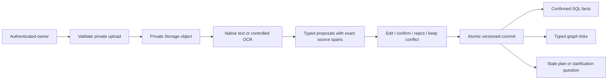

# Stage 4 implementation: personal documents and confirmed state

**Implemented and locally verified:** 11 September 2026  
**Scope:** fictional, isolated demo documents and the production-shaped private-document boundary  
**Engineering verdict:** complete for Stage 5 engineering  
**Live/public medical uploads:** closed until the release gates in this document are completed

## What Stage 4 now does

Stage 4 turns a private fictional document into reviewable proposals and changes
personal state only after an authenticated owner makes an explicit decision. A
proposal cannot personalize the dashboard, chat or a plan. Medication text is
stored as record-only wording and never becomes treatment advice.



## Architecture requirements and evidence

| Architecture requirement | Implemented result |
|---|---|
| Isolated synthetic profile | Demo files are conspicuously fictional and watermarked; each session receives its own resettable workspace. |
| Eight canonical documents | `DOC-001` through `DOC-008` each have editable source, PDF, extraction truth and typed graph truth. |
| Controlled OCR | One noisy image fixture has frozen OCR truth. OCR is dependency-injected and is used only when an image has no native text. |
| Upload validation | The supervised demo accepts only exact registered fixture hashes. PDF/PNG signature, MIME, size, lock, corruption and identity are checked before persistence; missing, blank, multiple, near-match and wrong identities fail closed. |
| Private original | Authenticated owner uploads to the private `medical-documents` bucket under a workspace/hash path. Failed metadata registration removes the orphaned object. |
| Structured classification/extraction | The deterministic fixture adapter proves the full demo without a provider. An optional OpenAI Responses Structured Outputs adapter is strict-schema, tool-free and `store=false`; it has no invented default model. |
| Candidate provenance | Every proposal keeps and displays document name, page, exact source quote, character offsets, PDF coordinates, extraction method, confidence, completeness, disposition and state. |
| Confirmation states | Every review choice starts empty. Save remains disabled until every row has a deliberate confirm, edit, reject or keep-conflict decision. Missing values require an explicit reject acknowledgement. |
| Confirmed state writes | One security-definer transaction checks owner, review completeness, expected version and idempotency key before writing health facts, medication records, appointments, graph links and dependency changes. |
| Conflict behavior | Older facts remain; the disagreement is stored, a clarification question is created, and conflicted information cannot personalize output. |
| Plan dependency | Confirmed restriction changes mark affected movement plans stale. |
| Prompt injection | Instruction-like PDF text remains inert document text and never reaches a tool or policy channel. |
| Cross-user isolation | Owners may read their records. Direct client mutation of proposals, derived facts and graph state is revoked; another user sees no private rows. |

## Main implementation files

- `app/schemas/documents.py`: document, proposal, provenance and review contracts.
- `app/services/personal_documents.py`: validation, parsing, controlled OCR,
  deterministic extraction, Storage/PostgREST integration and confirmation calls.
- `app/services/openai_document_extractor.py`: optional strict structured provider
  adapter with source-quote reconciliation.
- `app/pages_and_components/documents.py`: the rendered fictional upload and review
  flow.
- `supabase/migrations/20260911001100_stage4_document_confirmation.sql`: private
  storage metadata, proposal state, review ledger, commit functions, RLS and grants.
- `data/synthetic/expected_graph_changes/`: typed node/edge truth for all eight
  documents.
- `data/synthetic/noisy_variants/` and `data/synthetic/upload_edge_cases/`: frozen
  OCR and failure fixtures.

## Verification results

The same migration was verified in two database histories:

1. exact upgrade from migration `01000` with existing confirmed Stage 3 document,
   fact and medication rows; Stage 4 backfilled their decision provenance;
2. a blank database replay through migration `01200`.

Both histories passed:

- 206 transactional database assertions: 122 Stage 2, 26 Stage 3 onboarding,
  12 Stage 3 exit hardening, 35 Stage 4 document and 11 API-role hardening;
- 45 authenticated local API checks: 13 Storage, 17 onboarding and 15 document
  extraction/confirmation;
- zero database-lint findings.

The application evidence also passed:

- 175 Python regression tests;
- 64 public-content contract cases;
- 26 journey cases;
- Stage 3 and Stage 4 Streamlit render checks with zero network calls;
- Stage 1, Stage 2, Stage 3, Stage 4-readiness and Stage 4 implementation gates.

The machine-readable result is `docs/STAGE-4-CHECK-RESULTS.json`.

## Remote development database status

Migrations `01100` and `01200` are deployed to `nestline-dev`. The replacement
project-scoped token linked successfully, the migration dry run named only each
pending Stage 4 migration before it was applied, and the final dry run reports no
pending migrations. The remote catalogue has 14 migration rows, both Stage 4
functions, both authenticated execute grants, zero direct derived-state mutation
grants, and zero temporary fixtures.

The first remote schema comparison exposed 72 unintended anonymous grant changes
caused by automatic Data API exposure. Migration `01200` now revokes current table,
sequence and inherited function access, restores only six read-only published-
knowledge tables, and closes `postgres` defaults for future application objects.
All 206 pgTAP assertions pass locally and remotely, remote lint reports zero
findings, and the publishable-key API returns HTTP 200 for public content and HTTP
401 for the personal workspace table. A raw CLI diff still reports Supabase-managed `service_role` metadata and
one platform helper (`public.rls_auto_enable`); nine Nestline function definitions
match after CR/LF normalization and there is zero `anon` or `authenticated` role
drift. The secret-free proof is
`data/supabase/stage4-remote-verification.json`.

## Gates that code cannot complete

- Configure a deployable server-side malware scanner before accepting real medical documents.
- Select exact candidate extraction models and a per-document cost ceiling, then
  run the frozen fictional provider benchmark. Deterministic demo extraction does
  not depend on this choice.
- Complete qualified clinical and India-localisation review.
- Complete final rendered product review.

These gates block real/public medical use. They do not block Stage 5 engineering
against the isolated fictional dataset.

## Operator commands

```powershell
.venv\Scripts\python.exe -m unittest discover -s tests
.venv\Scripts\python.exe -m scripts.check_stage4_readiness --write-report
.venv\Scripts\python.exe -m scripts.check_stage4_ui
.venv\Scripts\python.exe -m scripts.check_stage4 --write-report
```

Database verification requires Docker Desktop and the local Supabase stack. Run
each `supabase/tests/*.test.sql` file sequentially, then the three API check
scripts. The repository CI records this exact order and checks both an upgrade
and a clean installation.
